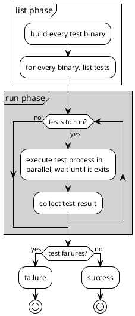

# Shipping TiKV with Cargo

Some thoughts and tips on how we use Cargo to ship TiKV.

[DONGPO LIU](https://github.com/0xPoe)

<div @click="$slidev.nav.next" class="mt-12 py-1" hover:bg="white op-10">
  Press Space to Start <carbon:arrow-right />
</div>

<div class="abs-br m-6 text-xl">
  <a href="https://github.com/0xPoe/tidb-analyze.slide" target="_blank" class="slidev-icon-btn">
    <carbon:logo-github />
  </a>
</div>

<!--
All right, let’s get started. Thank you for joining me today.

Today, I’d like to share some thoughts and practical tips on how we use Cargo to ship TiKV, a distributed transactional key-value database.
-->

---
layout: intro
class: pl-25
glowSeed: 14
transition: slide-up
---

<div text-5xl >Dongpo Liu</div>
<div op50 tracking-wide text-xl mt1 font-zh>刘东坡</div>

<div class="[&>*]:important-leading-10 opacity-80 mt5">
Senior Database Kernel Engineer@PingCAP <br/>
Cargo Maintainer@Rust<br/>
</div>

<div mt-10 w-min flex="~ gap-1" items-center justify-center>
  <div i-ri-user-3-line op50 ma text-xl />
  <div><a href="https://0xpoe.dev" target="_blank" class="border-none! font-300">0xPoe.dev</a></div>
  <div i-ri-github-line op50 ma text-xl ml4/>
  <div><a href="https://github.com/0xPoe" target="_blank" class="border-none! font-300">0xPoe</a></div>
  <div i-ri-linkedin-line op50 ma text-xl ml4/>
  <div ws-nowrap><a href="https://www.linkedin.com/in/dongpo-liu" target="_blank" class="border-none! font-300">Dongpo Liu</a></div>
</div>


<!--
Let me briefly introduce myself.
My name is Dongpo, and I’m a senior database kernel engineer at PingCAP, the company behind TiDB and TiKV.

We are building a distributed database called TiDB.
All of our products are open source. So feel free to check them out.

I’m a strong believer in open source, and I’m currently one of the maintainers of the Cargo project. In the past, I was also a member of the Rustup and crates.io teams.

You can find me online through these links. And feel free to reach out if there’s anything you’d like to discuss.
-->

---
transition: slide-up
layout: center
---

<div text-6xl fw100>
  Agenda
</div>

<br>

<div class="grid grid-cols-[3fr_2fr] gap-4">
  <div class="border-l border-gray-400 border-opacity-25 !all:leading-12 !all:list-none my-auto">

  - TiKV Project Overview
  - 6 Tips
  - Q&A

  </div>
</div>

<!--
First, I’ll give a brief overview of the TiKV project and its community.

Then, I’ll share six tips on how we use Cargo to ship TiKV.

Finally, we’ll wrap up with a Q&A session, where you can ask any questions you may have.
-->

---
transition: slide-left
layout: center
---

# TiKV Project Overview

<!--
Let's start with a brief overview of the TiKV project.
-->


---
transition: slide-left
---

# A distributed Transactional KV Database

Cluster Overview


<!--
As you can see, TiKV is a distributed transactional key-value database.
Under the hood, it uses Raft to keep data consistent across multiple instances.

This slide shows a typical TiKV cluster architecture. A cluster consists of multiple TiKV nodes, which are responsible for storing data. Each node runs multiple Raft groups to replicate data across the cluster.

The Placement Driver cluster manages metadata and handles scheduling for these Raft groups.

Since TiKV serves as the storage layer of our database system, it is designed to deliver high performance and low latency. That’s also why we chose to implement it in Rust.

The project started back in 2016.

Next, let’s zoom in and take a closer look at a single TiKV instance.
-->

---
transition: slide-left
---

# A distributed Transactional KV Database

Instance Deatails


<!--
Under the hood, TiKV uses RocksDB as its storage engine.
RocksDB is a high-performance C++ storage engine originally developed at Facebook and later open sourced.

If you look at our other components, such as TiDB—which serves as the compute layer of our database—you’ll notice that they are mostly built in Go.

However, TiKV relies heavily on RocksDB. For this kind of usage, Go wasn’t a great fit. Even though cgo is available, managing memory efficiently through the CGo interface can be quite challenging.

At the time, our co-founders were strong believers in Rust, so back in 2016, we decided to build TiKV in Rust.

That decision wasn’t without challenges. Rust was still very young—the 1.0 release had just come out—and the ecosystem was far from mature. We had to build many components from scratch.
-->

---
transition: slide-left
---

# TiKV Community

- [jemallocator](https://github.com/tikv/jemallocator)
- [rust-prometheus](https://github.com/tikv/rust-prometheus)
- [raft-rs](https://github.com/tikv/raft-rs)
- [pprof-rs](https://github.com/tikv/pprof-rs)
- [grpc-rs](https://github.com/tikv/grpc-rs)
- [fastrace](https://github.com/fast/fastrace)
- [fail-rs](https://github.com/tikv/fail-rs)

<!--
As you can see, we’ve contributed quite a lot to the Rust ecosystem, especially in the areas of systems programming and distributed systems.

Several of these projects are widely used in the Rust community. For example, we maintain the jemalloactor rust implementation, and we also built the first Rust client for Prometheus.

We even open sourced our core implementation of the Raft algorithm in Rust.

At the same time, we borrowed many good ideas from the Go community. One example is that we built the first implementation of pprof in Rust, which allows you to collect and inspect CPU profiles. This tool is extremely useful when you’re doing performance investigations.

In addition, TiDB is composed of multiple layers, and these layers communicate with each other using gRPC. As a result, we implemented the first high-performance gRPC framework in Rust. It has been used in production and delivers very strong performance.

Beyond that, we’ve also developed a number of smaller libraries to improve observability and testing infrastructure.

Please feel free to check them out—we hope these tools can be useful to you as well.
-->

---
transition: slide-left
---

# TiKV

<div class="grid grid-cols-3 gap-8 text-center mx-auto w-fit mt-32">
  <div>
    <div class="text-5xl font-bold">500K+</div>
    <div class="text-sm opacity-75">lines of Rust</div>
  </div>
  <div>
    <div class="text-5xl font-bold">83</div>
    <div class="text-sm opacity-75">crates</div>
  </div>
  <div>
    <div class="text-5xl font-bold">600+</div>
    <div class="text-sm opacity-75">dependencies</div>
  </div>
</div>

<!--
Let’s talk about the TiKV codebase.

TiKV consists of over 500,000 lines of Rust code, organized into 83 crates. It also depends on around 600 dependencies, all of which are managed using Cargo.

Given this scale, it’s fair to say that Cargo plays a critical role in our day-to-day development workflow.

With that in mind, let’s dive into some practical tips for shipping TiKV with Cargo and managing a project at this scale.

In this talk, we’ll focus specifically on how we use Cargo—sharing tips and tricks from our experience—rather than diving into the internals of the database itself.

So, let’s get started.
-->

---
transition: slide-up
layout: center
---

# 6 Tips for Shipping TiKV with Cargo

<!--

-->

---
transition: slide-left
---

# Always check in `Cargo.lock` [^1]

1. For applications, always check in `Cargo.lock` to ensure reproducible builds.
2. For libraries, also check in `Cargo.lock` to ensure consistent dependency resolution across different environments. [^2] [^3]

<br/>

[^1]: [tikv#4](https://github.com/tikv/tikv/commit/c9b10c33ab2a94f816b00c2d093334434daa1082)
[^2]: [cargo#12382](https://github.com/rust-lang/cargo/pull/12382)
[^3]: [cargo#8728](https://github.com/rust-lang/cargo/issues/8728)

<!--
The first tip is to always check in your Cargo.lock file.

For applications, this is already a standard practice, since it guarantees reproducible builds—and Cargo actually enables this by default.

TiKV is definitely an application. We have multiple binary targets, and although we also have some library targets, we’ve checked in our Cargo.lock file from the very beginning.

This ensures that everyone uses the exact same dependency versions and avoids surprises during builds—not only on local machines, but also in CI environments.

Interestingly, Cargo has also updated its guidance for libraries. Today, both applications and libraries are encouraged to check in Cargo.lock, which helps keep dependency resolution consistent across different environments.

Historically, the main reason for excluding Cargo.lock in libraries was to test against the latest versions of dependencies. However, this often leads to unexpected breakages when an upstream dependency releases a new version.

By checking in Cargo.lock, we avoid this kind of risk and gain full control over our dependency set. For example, your CI won’t suddenly fail just because an upstream release introduced a breaking change.

This situation is quite common: a contributor submits a perfectly valid pull request, but the CI fails for reasons completely unrelated to their changes—simply because a dependency was updated. That can be very frustrating.

At the same time, as a library maintainer, you may still want to understand how your project behaves with the latest dependencies. In that case, a good approach is to set up a separate CI job that periodically updates dependencies and runs tests.

This way, you can catch issues early without disrupting your main development workflow.
-->

---
transition: slide-left
---

# Always check in `Cargo.lock` 

Check latest dependencies regularly

```yaml {all|5}
jobs:
  latest_deps:
    name: Latest Dependencies
    runs-on: ubuntu-latest
    continue-on-error: true
    steps:
      - uses: actions/checkout@v3
      - run: rustup update stable && rustup default stable
      - run: cargo update --verbose
      - run: cargo build --verbose
      - run: cargo test --verbose
```

<!--
Here’s an example of a GitHub Actions workflow.

This job checks out the code, updates dependencies, builds the project, and then runs the test suite.

One important detail is that you can set continue-on-error to true. With this setting, even if something breaks, the job won’t fail the entire workflow.

This allows you to continuously monitor dependency updates without disturbing your main CI pipeline or blocking merges.

The same idea applies to most other CI systems as well—you can usually configure a non-blocking job to track dependency updates in a similar way.
-->

---
transition: slide-left
---

# Workspace inheritance

The `package` table [^1]

```toml
# [PROJECT_DIR]/Cargo.toml
[workspace]
members = ["bar", "baz"]

[workspace.package]
authors = ["Nice Folks"]
homepage = "https://example.com"
rust-version = "1.70"
publish = false
```

````md magic-move
```toml
# [PROJECT_DIR]/bar/Cargo.toml
[package]
name = "bar"
authors = ["Nice Folks"]
homepage = "https://example.com"
rust-version = "1.70"
publish = false
```

```toml
# [PROJECT_DIR]/bar/Cargo.toml
[package]
name = "bar"
authors.workspace = true
homepage.workspace = true
rust-version.workspace = true
publish.workspace = true
```
````

[^1]: [Cargo Book: Workspace Package Table](https://doc.rust-lang.org/cargo/reference/workspaces.html#the-package-table)

<!--
The next tip is to use workspace inheritance for the package table.

As you can see here, we define the package table at the workspace level. It includes fields such as authors, homepage, rust-version, and the publish setting.

Without this feature, you would have to repeat the same set of metadata again and again in every single crate, which quickly becomes tedious and error-prone.

With workspace inheritance, you can simply mark these fields with workspace = true, and all member crates will automatically inherit them from the workspace Cargo.toml.

This is extremely useful for maintaining consistency across a large codebase. In a project of this size, most crates share the same metadata, and this approach significantly simplifies maintenance while reducing duplication.
-->

---
transition: slide-left
---

# Workspace inheritance

The `dependencies` table [^1]

```toml
# [PROJECT_DIR]/Cargo.toml
[workspace]
members = ["foo", "bar"]
[workspace.dependencies]
cc = "1.0.73"
rand = "0.8.5"
regex = { version = "1.6.0", default-features = false, features = ["std"] }
```


````md magic-move
```toml
# [PROJECT_DIR]/bar/Cargo.toml

[dependencies]
regex = { version = "1.6.0", features = ["unicode"] }
[build-dependencies]
cc = "1.0.73"
[dev-dependencies]
rand = "0.8.5"
```

```toml
# [PROJECT_DIR]/bar/Cargo.toml
[dependencies]
regex = { workspace = true, features = ["unicode"] }
[build-dependencies]
cc.workspace = true
[dev-dependencies]
rand.workspace = true
```
````
[^1]: [Cargo Book: Workspace Dependency Table](https://doc.rust-lang.org/cargo/reference/workspaces.html#the-dependencies-table)

<!--
Similarly, you can also use workspace inheritance for dependencies.

As shown here, we define shared dependencies in the workspace-level dependency table. These dependencies can then be reused across multiple crates.

Without this feature, each crate would need to repeat dependency versions, feature flags, and other configuration over and over again. In a large project, this quickly becomes hard to maintain.

In practice, many crates within the same workspace depend on the same libraries. With workspace dependency inheritance, you can simply set workspace = true, and those crates will automatically inherit the dependency configuration.

This dramatically reduces the burden of version updates. Previously, updating a dependency meant touching every crate that used it. Now, you only need to change a single line in the workspace dependency table.

This also makes dependency update tools—such as Dependabot—much easier to work with. Updates become simpler to review, since they often result in just a one-line change.
-->

---
transition: slide-left
---

# Workspace inheritance

A known issue [^1]


```toml
# [PROJECT_DIR]/Cargo.toml
[workspace]
members = ["foo", "bar"]
[workspace.dependencies]
cc = "1.0.73"
rand = "0.8.5"
regex = { version = "1.6.0", default-features = false, features = ["std"] }
tracing = "0.1.37"

# [PROJECT_DIR]/foo/Cargo.toml
[dependencies]
tracing = { workspace = true }

# [PROJECT_DIR]/bar/Cargo.toml
[dependencies]
tracing = { workspace = true, default-features = false } # warning: default-features ignored
```

[^1]: [cargo#12162](https://github.com/rust-lang/cargo/issues/12162)

<!--
That said, I also want to highlight a known issue with workspace dependency inheritance.

In this example, we have a workspace with two member crates, foo and bar. Both of them depend on the tracing crate.

For the foo crate, it simply inherits the dependency from the workspace, which works as expected.

However, the bar crate also inherits tracing from the workspace, but it wants to disable the default features. Unfortunately, this doesn’t work as intended. Once default features are enabled at the workspace level, member crates cannot selectively disable them.

The workaround here is to disable default features at the workspace level first. Then, in each individual crate, you can explicitly enable or override features on a crate-by-crate basis.

This behavior can sometimes be surprising, so it’s something to be aware of when using workspace dependencies to manage shared libraries.

Hopefully, this issue will be addressed in a future Rust edition. Fixing it would require a behavior change, which is why it has to wait until the next edition.
-->

---
transition: slide-left
---

# Git Dependencies

`-Zgit=shallow-deps` unstable feature [^1]

| Command | User Time | System Time | Total |
|---------|-----------|-------------|-------|
| `cargo build` | 1013.69s | 152.69s | 3:27.03 |
| `cargo build -Zgit=shallow-deps` | 1017.79s | 152.84s | 2:43.67 |


```bash {*}{maxHeight:'150px'}
    Updating git repository `https://github.com/rust-lang/cmake-rs`
    Updating git repository `https://github.com/tikv/fs2-rs`
    Updating git repository `https://github.com/pingcap/rust-protobuf`
    Updating git submodule `https://github.com/google/protobuf`
    Updating git submodule `https://github.com/google/benchmark.git`
    Updating git repository `https://github.com/tikv/raft-rs`
    Updating git repository `https://github.com/tikv/rust-snappy.git`
    Updating git submodule `https://github.com/google/snappy.git`
    Updating git repository `https://github.com/tikv/sysinfo`
    Updating git repository `https://github.com/tikv/tame-oauth`
    Updating git repository `https://github.com/pingcap/kvproto.git`
    Updating git repository `https://github.com/tikv/raft-engine.git`
    Updating git repository `https://github.com/tikv/slog-global.git`
    Updating git repository `https://github.com/tikv/tokio`
    Updating git repository `https://github.com/tikv/yatp.git`
    Updating git repository `https://github.com/tikv/procinfo-rs`
    Updating git repository `https://github.com/tikv/tracing-active-tree.git`
    Updating git repository `https://github.com/tikv/rust-rocksdb.git`
    Updating git submodule `https://github.com/tikv/rocksdb.git`
    Updating git submodule `https://github.com/tikv/titan.git`
    Updating git repository `https://github.com/tikv/encoding_rs.git`
    Updating git repository `https://github.com/pingcap/tipb.git`
```

[^1]: [git-shallow-deps](https://doc.rust-lang.org/cargo/reference/unstable.html#git)

<!--
Once all the crates and projects are set up, the next thing we need to think about is the build phase.

In this phase, I’d like to share a practical trick we use in the TiKV project. As I mentioned earlier, many of the libraries we depend on are actually wrappers around C++ projects.

As a result, when building TiKV, we also have to compile a significant amount of C++ code. In addition, we rely on many Git-based dependencies, and some of them are large C++ projects with long commit histories.

Cloning these repositories can be quite slow and often becomes a noticeable part of the build time.

To speed this up, we enable Cargo’s shallow Git dependency support, which is currently an unstable feature. With this setting, Cargo performs shallow clones instead of fetching the full Git history.

As you can see from the numbers here, without this feature, a cargo build takes around 3 minutes and 27 seconds. After enabling shallow Git dependencies, the build time drops to 2 minutes and 43 seconds—an improvement of more than 30 seconds.

This optimization is especially useful for projects with many Git dependencies. It significantly speeds up the cloning process and can noticeably improve overall build times.
-->

---
transition: slide-left
---

# Cargo Profiles

A tiny historical mistake!

```toml {all|4}
[profile.dev]
opt-level = 0
debug = 0
codegen-units = 4
lto = false
incremental = true
panic = 'unwind'
debug-assertions = true
overflow-checks = false
rpath = false
```

<!--
Let’s continue talking about the build phase, and specifically about Cargo profiles.

As you all know, Rust provides multiple build profiles: dev, release, test, and even bench. Today, I want to focus on the dev profile, because this is the one that affects our daily work the most.

We don’t really worry too much about release builds here—we all know they’re slow, and that’s expected. What really matters is developer build speed.

In the early days of TiKV, a full build could take anywhere from one to two hours. That meant you only had a handful of chances to build the project in a single day. 

To address this, we tuned our dev profile to prioritize build speed over runtime performance.

First, we disabled optimizations, since performance is not our primary concern in development builds.

Second, we turned off debug information. This significantly reduces compile time and also helps shrink binary size.

We also set codegen-units to 4, which allows the compiler to generate code in parallel and further speeds up compilation.

Interestingly, there’s a small historical mistake in this dev profile. I’m not sure if you can spot it.

I won’t go through every possible configuration here—you can find the full list in Cargo’s documentation.
-->

---
transition: slide-left
---

# Cargo Profiles - `codegen-units`

A tiny historical mistake!

| codegen-units | Dev Build Time |
|---------------|------------|
| 4 [^1][^2]             | 3:11       |
| 256[^3]          |  <span v-mark="{ color: 'green', type: 'circle' }">2:55</span>   |


[^1]: [2014](https://github.com/rust-lang/rust/commit/cf672850)
[^2]: [2016](https://github.com/tikv/tikv/pull/1393/changes)
[^3]: [2020](https://github.com/rust-lang/rust/pull/70156)

<!--
So here’s the small mistake we made in the past.

We set codegen-units to 4 in our Cargo configuration. However, today the default value is actually 256.

As you can see from this benchmark, with the default setting, the build time is reduced from 3 minutes and 11 seconds to 2 minutes and 55 seconds, which is roughly a 20-second improvement.

The reason we originally set this value to 4 was historical. Back in 2014, the Rust compiler defaulted to a single codegen unit, which resulted in very long build times. At that time, increasing it to 4 was a reasonable optimization.

Over the years, the compiler has improved significantly. Incremental compilation was introduced, and in 2020 the default number of codegen units was increased to 256.

As a result, today you usually don’t need to manually tune this option anymore—Cargo already picks a good default for you.

That said, if you do choose to tweak compiler or Cargo settings, it’s important to revisit them periodically as the compiler evolves, and make sure old optimizations don’t quietly turn into new bottlenecks.
-->

---
transition: slide-left
---

# Cargo Profiles - `debug`
A cmake-rs issue [^1]


```toml {all|2,4-6|2,7-9}
[profile.dev]
debug = 0
...
[profile.dev.package.librocksdb_sys]
debug = false
opt-level = 1
[profile.dev.package.tests]
debug = 1
opt-level = 1
```

| debug | Build Time | Binary Size |
|-------|------------|-------------|
| true | 3:21 | 599M |
| 0 | **3:00** |  <span v-mark="{ color: 'green', type: 'circle' }">478M</span> |

[^1]: [cmake-rs#79](https://github.com/rust-lang/cmake-rs/issues/79#issuecomment-494676960)

<!--
Another story— and a very practical trick —we used to improve TiKV’s build time is related to debug information.

As I mentioned earlier, TiKV uses RocksDB as its storage engine, which means we compile a large amount of C++ code through the cmake-rs crate.

At the time, we wanted to reduce both the binary size and the overall build time. Naturally, we tried disabling debug information by setting debug = 0 in our Cargo profiles.

However, even after doing that, we noticed that the final binary was still very large, and the build time was still slow. Some debug information was clearly still being generated.

After some investigation, we found that cmake-rs was forcing debug information for the C++ code and effectively ignoring our global Cargo profile settings. The full discussion and details can be found in this GitHub issue.

Our workaround was to override the profile settings specifically for the librocksdb-sys crate. In this configuration, we explicitly disabled debug information and set the optimization level to 1.

With these settings in place, CMake finally respected our configuration. As a result, the build time was reduced by around 20 seconds, and the binary size dropped by more than 100 megabytes.

This is a huge improvement, especially if your project depends on large C++ codebases.

At the same time, while we disabled debug information for the final TiKV binary, we still wanted useful debugging support when running tests. So for test builds, we explicitly set debug = 1.

This gives us a good balance: fast builds and small binaries for final binaries, while still retaining enough debug information to investigate failing tests.

This is another example of how carefully tuning Cargo profiles can significantly improve developer experience in large, mixed-language projects.
-->

---
transition: slide-left
---

# nextest-rs/nextest [^1]

tokio: 1647 tests in 228 binaries [^2]

| Command | User Time | System Time | Total |
|---------|-----------|-------------|-------|
| `cargo test` | 106.31s | 50.83s | 236.03s |
| `cargo nextest run` | 15.46s | 6.52s | <span v-mark="{ color: 'green', type: 'circle' }">5.92s</span> |

[^1]: [nextest](https://nexte.st/)
[^2]: [tokio](https://github.com/tokio-rs/tokio)

<!--
Now let’s talk about testing.
After building the project, the next step is running tests—and this is another area where we can significantly improve developer productivity.

This tip is about speeding up test execution by leveraging a community tool called nextest.

Nextest accelerates test execution by running tests in parallel and optimizing the overall test scheduling process.

Let’s take Tokio as an example. Tokio has more than 1,000 tests spread across over 200 binaries. Most of these are unit tests distributed across many packages.

With the default cargo test command, the total execution time is more than 200 seconds.

When using Nextest, the entire test suite can finish in under 6 seconds. That’s an extremely dramatic improvement.

This kind of speedup is especially impactful for large projects. In TiKV, we have more than 4,000 tests, and Nextest has been a real game changer for our CI pipeline.

For projects at this scale, faster tests directly translate into faster feedback loops and much more efficient development.
-->

---
transition: slide-left
layout: two-cols-header
---

# Why `cargo test` is slow?

::left::

<div style="margin-top: -2rem; display: flex; justify-content: center;">

```plantuml {scale: 0.8}
@startuml
!theme plain
start
:build every test binary;

while (binaries to run?) is (yes)
  :run binary, wait until it exits; <<#LightGray>>
  if (exit code 0?) then (yes)
  else (no)
    :failure;
    stop
  endif
endwhile (no)

:success;
stop
@enduml
```
</div>

::right::

<div style="margin-top: -2rem; display: flex; justify-content: center;">



</div>

<!--
You might be wondering why cargo test is slow.

The reason becomes clear if you look at how cargo test works internally.

With cargo test, Cargo builds every test binary—what I’ll call a test crate or test target—and then runs them one by one.

Within a single test binary, tests may run in parallel, but across different test binaries, execution is strictly sequential. Cargo won’t start running the next test binary until the previous one has finished.

This becomes a serious bottleneck in large workspaces with many crates and many test targets.

Nextest takes a different approach. It splits the entire test process into two phases.

The first phase is the list phase. In this phase, Nextest still builds each test binary, but instead of running tests immediately, it invokes the test binary to list all available tests.

The second phase is the run phase. In this phase, Nextest executes tests in parallel across processes and across test binaries. This allows much higher concurrency compared to cargo test.

Finally, Nextest collects all results and presents a unified test report.

This difference in execution model is the main reason why Nextest is so much faster than cargo test.

So, with that being said, it might sound like we can blindly trust Nextest for all our projects… right?
-->

---
transition: slide-left
---

# Surprise!

cargo: 4216 tests in 3 binaries 

| Command | User Time | System Time | Total |
|---------|-----------|-------------|-------|
| `cargo test` | 523.01s | 431.60s | 324.46s |
| `cargo nextest run` | 721.57s | 464.16s |  <span v-mark="{ color: 'red', type: 'circle' }">329.90s</span> |

<br/>

<div class="bg-white text-black p-2 rounded font-mono text-sm">
<span class="text-red-600">█ Summary</span> [ 329.395s] 4216 tests run: 4163 <span class="text-green-600">passed</span>, 53 <span class="text-red-600">failed</span>, 36 <span class="text-yellow-600">skipped</span>
</div>

<br/>

1. Most tests are concentrated in a few binaries.
2. Cargo's tests rely on shared state, which causes failures when run in parallel across processes.

<!--
Here’s a surprising result—from Cargo itself.

If you try to use nextest on the Cargo codebase, you’ll actually find that Nextest is slower than cargo test.

In Cargo, we have more than 4,000 tests, but they are concentrated in just three test binaries, because most of them are end-to-end integration tests.

As a result, when running tests with Nextest, the total runtime ends up being even longer than cargo test, and we also observe a large number of test failures.

There are two main reasons for this.

First, because the tests are concentrated in only a few test binaries, Cargo doesn’t really benefit from Nextest’s execution model. There simply isn’t much additional concurrency to gain.

Second, many of Cargo’s integration tests rely on shared state, such as reading from and writing to disk. When these tests are executed in parallel across processes, they can interfere with each other, leading to flaky or failed tests.

So whether Nextest is faster really depends on your test structure.

If most of your tests are unit tests spread across many crates—like in Tokio—Nextest can deliver dramatic speedups.

But if your project mainly consists of a small number of large integration test binaries, Nextest may not help at all—and it may even break tests that rely on shared state.

So while Nextest is a very powerful tool, it’s important to evaluate whether it actually fits your project before introducing it.
-->

---
transition: slide-left
layout: two-cols-header
---

# Integration Tests

Put all integration tests in a single binary


::left::


<div class="mx-2">

````md magic-move {at:1}
```rust {1,8}
# tests/test1.rs
#[test]
fn test_addition() {
    let sum = 2 + 2;
    assert_eq!(sum, 4);
}

# tests/test2.rs
#[test]
fn test_subtraction() {
    let difference = 5 - 3;
    assert_eq!(difference, 2);
}
```

```rust {1-3,5,12}
# tests/testsuite/main.rs
mod test1;
mod test2;

# tests/testsuite/test1.rs
#[test]
fn test_addition() {
    let sum = 2 + 2;
    assert_eq!(sum, 4);
}

# tests/testsuite/test2.rs
#[test]
fn test_subtraction() {
    let difference = 5 - 3;
    assert_eq!(difference, 2);
}
```
````
</div>

::right::

<div class="mx-2">

````md magic-move {at:1}
```bash {11-13,17-19}
.
├── Cargo.lock
├── Cargo.toml
├── src
│   └── main.rs
├── target
│   ├── CACHEDIR.TAG
│   ├── debug
│   │   ├── build
│   │   ├── deps
│   │   │   ├── foo-a5cef2429056f6e1
│   │   │   ├── test1-4c1f19403823faf2
│   │   │   ├── test2-ede9a97ce0a4eb10
│   │   ├── examples
│   │   └── foo
│   └── tmp
└── tests
    ├── test1.rs
    └── test2.rs
```

```bash {11-13,16-20}
.
├── Cargo.lock
├── Cargo.toml
├── src
│   └── main.rs
├── target
│   ├── CACHEDIR.TAG
│   ├── debug
│   │   ├── build
│   │   ├── deps
│   │   │   ├── foo-a5cef2429056f6e1
│   │   │   ├── foo-e471945388faef79
│   │   │   └── testsuite-c27e06ab2ed00b25
│   │   ├── examples
│   │   └── foo
└── tests
    └── testsuite
        ├── main.rs
        ├── test1.rs
        └── test2.rs
```
````
</div>

<!--
As I mentioned earlier, whether Nextest helps or not really depends on your test structure.

So I’d like to share an additional tip on how to manage and organize integration tests more efficiently.

The core idea is simple: try to put all your integration tests into a single test binary.

Let me show you an example. Suppose a project has two integration tests, test_one and test_two, and they are placed as separate files under the tests directory.

With this structure, Cargo will generate two separate test binaries—one for each file. This increases both build time and test execution overhead.

A useful trick to avoid this is to group all integration tests into a single test suite.

Instead of having multiple test files directly under tests, you can create a subdirectory—for example, tests/test_suite—and add a main.rs file there.

In that main.rs, you include test_one and test_two as modules of the same test suite.

With this setup, Cargo will only produce one integration test binary for the entire suite.

This approach reduces build time, and it also significantly improves test execution speed, because tests within a single binary can run in parallel.

This is a simple structural change, but it can make a big difference—especially for large projects with many integration tests.
-->

---
transition: slide-left
---

# Linters

Clippy [^1]

```toml
[[disallowed-methods]]
path = "std::thread::Builder::spawn"
reason = """
Wrapper function `<std::thread::Builder as tikv_util::sys::thread::StdThreadBuildWrapper>::spawn_wrapper`
should be used instead, refer to https://github.com/tikv/tikv/pull/12442 for more details.
"""

[[disallowed-types]]
path = "openssl::cipher::Cipher::fetch"
reason = """
When a Some(...) value was passed to the properties argument of openssl::cipher::Cipher::fetch, \
a use-after-free would result. See RUSTSEC-2025-0022
"""
```


[^1]: [Clippy Disallowing Methods and Types](https://rust-lang.github.io/rust-clippy/master/index.html#disallowed_methods)

<!--
After building and testing the project, the next phase is long-term maintenance.

And for maintenance, my final tip is to use linters as much as possible.

I believe most of you are already familiar with Clippy and probably use it in your daily workflow. What I want to highlight here are some of Clippy’s more advanced features that allow you to enforce project-specific rules.

Let me use TiKV as an example. In our project, we don’t want developers to directly use the standard thread spawn API. Instead, we require all threads to be created through a wrapper, where we can perform additional checks and bookkeeping.

To enforce this consistently, we simply disallow the original API using Clippy, and provide a clear explanation of why this API is forbidden and what should be used instead.

This is a very effective way to enforce team-wide standards and prevent accidental misuse of APIs that are unsafe or inappropriate for your project.

The same approach applies to many other cases as well. Clippy offers a rich set of advanced configurations that allow you to encode project conventions directly into the tooling.
-->

---
transition: slide-left
---

# Linters

Cargo Deny [^1]

```toml
[licenses]
version = 2
private = { ignore = false }
allow = ["0BSD", "Apache-2.0", "BSD-3-Clause", "CC0-1.0", "ISC", "MIT", "Zlib", "Unicode-3.0"]
exceptions = [
    { name = "unicode-ident", allow = ["Unicode-DFS-2016"] },
    { name = "slog-json", allow = ["MPL-2.0"] },
    { name = "smartstring", allow = ["MPL-2.0"] },
    { name = "inferno", allow = ["CDDL-1.0"] },
]

[sources]
unknown-git = "deny"
unknown-registry = "deny"
allow-org = { github = ["tikv", "pingcap", "rust-lang"] }
```

[^1]: [Cargo Deny](https://embarkstudios.github.io/cargo-deny/)

<!--
Another powerful linting and policy enforcement tool I’d like to introduce is Cargo Deny.

As I mentioned earlier, TiKV is an open-source project, and we have strict requirements when it comes to dependency licenses.

With cargo-deny, we can explicitly define an allowlist of acceptable licenses. Cargo Deny then automatically checks all dependencies against this list.

This is extremely useful, because doing this manually would be very difficult. Every time you introduce a new dependency, you’d have to remember to check its license—and not every contributor or developer is aware of these requirements.

Beyond license checks, Cargo Deny also helps us enforce supply-chain policies. For example, we forbid unknown Git dependencies and unknown registries, except for the default registry.

We also restrict Git dependencies to only trusted organizations, such as PingCAP and RustLang.

This helps us avoid accidentally depending on untrusted third-party code.

Overall, Cargo Deny is a very powerful tool for maintaining large open-source projects with strict license and security requirements. And it provides many other useful features that are worth exploring.
-->

---
transition: slide-left
---

# Linters

Lints inheritance [^1]

```toml
# [PROJECT_DIR]/Cargo.toml
[workspace]
members = ["crates/*"]

[workspace.lints.rust]
unsafe_code = "forbid"
```

````md magic-move
```toml
# [PROJECT_DIR]/crates/bar/Cargo.toml
[package]
name = "bar"
version = "0.1.0"

[lints.rust]
unsafe_code = "forbid"
```

```toml
# [PROJECT_DIR]/crates/bar/Cargo.toml
[package]
name = "bar"
version = "0.1.0"

[lints]
workspace = true
```
````

[^1]: [Cargo Book: Workspace Lints Table](https://doc.rust-lang.org/cargo/reference/workspaces.html#the-lints-table)

<!--
Regarding linters, I’d like to mention workspace inheritance once again.

In addition to packages and dependencies, Cargo also supports workspace-level lint configuration.

You can define lint tables for the Rust compiler and for Clippy at the workspace level, and then share these rules across all member crates.

The mechanism is very similar to package and dependency inheritance. You simply mark the configuration with workspace = true, and all crates in the workspace will inherit the same lint rules.

This is extremely useful for maintaining consistency across a large project. Instead of duplicating lint settings in every crate, you define them once and apply them everywhere.
-->

---
transition: slide-left
layout: two-cols-header
---

# Linters

Cargo Linting System is coming soon! [^1]

<div>

```toml
[package]
name = "foo"
edition = "2021"
[dependencies]
dep = "1.0"
[lints.cargo]
implicit_minimum_version_req = "warn"
```

</div>

<br/>

<div>

<pre class="bg-white text-dark-800 p-2 rounded font-mono text-xs border border-gray-300" style="white-space: pre;"><span class="text-yellow">warning:</span> dependency version requirement without an explicit minimum version
<span class="text-blue"> --></span> Cargo.toml:6:9
<span class="text-blue">  |</span>
<span class="text-blue">6 |</span> serde = "1.0"
<span class="text-blue">  |</span><span class="text-yellow">          ^^^^^ missing full version components</span>
<span class="text-blue">  |</span>
<span class="text-cyan">help:</span> consider specifying full `major.minor.patch` version components
<span class="text-blue">  |</span>
<span class="text-blue">6 |</span> serde = "1.0<span class="text-green">.0</span>"
<span class="text-blue">  |</span><span class="text-green">              ++</span>
</pre>

</div>


[^1]: [Cargo Linting System](https://github.com/rust-lang/cargo/issues/12235)

<!--
I’d like to wrap up this talk by looking at what’s coming next.

Cargo itself is currently working on a new manifest-level linting system. This system will allow you to define lint rules directly in Cargo.toml.

Conceptually, it’s similar to Rust compiler lints or Clippy lints, but instead of focusing on Rust code, it focuses on Cargo manifests themselves.

Here’s an example. In this manifest, we define a lint table that is specific to Cargo. Inside this table, we can specify various lint rules.

In this case, we mark a minimum version requirement as a warning. Because the dependency version is not fully specified, Cargo emits a warning along with a very helpful message explaining how to fix it.

This kind of linting helps catch common mistakes early and enforces best practices directly at the manifest level.

The feature is still under development, but it already looks very promising. If you’re interested, you can follow the corresponding GitHub issue to track its progress.
-->

---
transition: slide-up
layout: center
---

# Q&A

<br/>
<br/>

## Thank you!

<br/>

## Do you have any questions?

<!--
All right, that wraps up my tips from shipping TiKV with Cargo.

I hope you found these ideas useful and that you can apply some of them in your own projects.

Now I’d love to hear from you. Any questions?
-->

---
transition: slide-up
layout: center
---


<img class="w-[80%] h-[80%] mx-auto" src="data:image/png;base64,iVBORw0KGgoAAAANSUhEUgAAAfQAAAH0CAYAAADL1t+KAAAQAElEQVR4AezdjXrbtg4A0KDv/8y3d+nWpk5kR4L4z7NvaWNbJIED2ZBlb/rx0z8ECBAgQIDA9AI/3vxDgAABAgQITC/woqH/vJ+cGQgQIECAAIEmAi8aejQJwCIECBBYQsB7oCXKOHMSLxr68GkJkACB3wKayW+Jfn97D9TP3sq/BDT0Xwz+IDC5wOjNxAHH5DuY8GcQ0NCfVcn9BAYSmL4fjn7AMVCthUIgK6ChZ+WMI9BQ4Eo/nL75N3S1FIGVBDT0PtW0KoFqAleaf7UgTEyAQHMBDb05uQUJECBAgEB5AQ29vOmnGTucAP0UgZv9BFS/n72VCewmoKFXr7gToNWJB15A9QcujtAILCagoS9W0AbpWIIAAQIEBhTQ0AcsipAIECCwpYDPqB7LftFDQ3/kc6u3gPUJENhXwGdUj7W/6KGhP/Kdv3XxyOn8xLYkQIAAgVUEWrYKDT2711w8csouY1xRAZMRIECgqUDLVqGhNy2txQgQIECAQB0BDb2Oq1l3FJAzAQIEOgoUbegR8RbhJ6KvQev9KSKX7yxxRuTyi8iNm8UlG2dEziUiN651nCXW+3Eh1xLrReRsI4yLuGeQrd/RuKIN/WgB9xGoK9DyKyd1M/lmdg9vJGCv3qjYBVPV0AtimqqHQPRY1JoECBAYTkBDH64kAnoQ8FblgaPaDRMPKuCAddDCDBmWhj5kWQT1R8Dr2R8Kv+wo4Ih2x6pnc9bQs3LGESBwVsB2BAg0EDjX0B0kNiiFJQgQIECAQF7gXEN32jMvbCQBAnUFzE6AwC+Bcw3916b+IECAAIHvBZzS/N5ozy1qvzfW0Pfcr5bL2kvociUdJaFEHLVfthMhGTKEQO3XKQ19iDIL4q7A6C+ho8d31994AgT6C2jo/Wsggg0Eah+Zb0C4ZoorZuXotVtVNfRu9BYmQIDAggKOXrsVVUPvRm9hAgQIVBUw+WYCQzT0nz9/vvn5atB6X4yI1NXyxHkskN2nI3J1iMiNy8Z5nPV490bkXMbLZIyIsvvL6uNGqM4QDX0ECDEQIDCvQMwb+ryRi3w4AQ19uJIIiACBqwI+tr0qZvsVBTT0FasqJwIECMwtIPqEgIaeQDOEwHUB7yGvmxlBgMAVAQ39Xctr7buCn6oCPuWtymvyaQW6vPxOq/U6cA393cdr7buCHwIECDQX8PJbjlxDL2dpJgIECBAg0E1AQ+9Gb2ECBAgQIPCXwM3PHzT0vyz9SoAAAQIEugmc+fzhRXAa+gscDxEgQGBWgZtv9mZNe5+4Dwqsoe9TfpkSIFBY4OYbqsLRPE43cmyPkbqVEjgocIGGngrFIAKbChwcVm8qsULaqrlCFdfJQUNfp5YymULg4LB6irgFSeC6gAOe62Z3Rgzf0F8lFxGpq4NFtB33KoedH4vI1WGWqzZF5PLL7hNZl6vr/X6Rjsjl1yrO33ll18uO+72uv9/e4u3jn4h4ixj/5yPi+X6buqHPxy1iAvMLxPwpyIDAJYFfB7G//rg0rPnGmzf05t4WJECAAIHJBH4dxP76Y+zANfSx6yM6AgQIECBwSkBDP8WU28goAgQIECDQSkBDbyVtHQIECBAgUFFAQy+G2/oDlmKBm4gAAQIEFhDQ0IsVcYKvQBbL1UQECBAgMJrAvYauh41Wz2LxmIgAAQIE5hK419CdZZ6r2qIlQIAAgWUF7jX0ZVkkVlfA7AQIECBQWkBDLy1qPgIECBAg0EFAQ++AXnJJn3p81XQPAQIEdhTQ0Cevuu8lTl5A4ROoJOC1oRLswNNq6AMXp3Vora8u1Xq9iChwtafzc2Tzy46LOB9bxMe2rfeziI+1I87/3tol4nxsER/btvZ8tl48e8D9ywpo6MuWVmIECIwt4D302PWZLzoNfb6aiXhhAantJOA9dPdqL1YCDb37HiUAAgQIEOgisNhJEg29y1600KKLPSHqVqY3Vt3szE6AQF8BDb2v//yrL3bKqm5BYNX1NTuBvQU09L3rL3sCxQRMRIBAXwENva+/1QkQIECAQBEBDf0mo5OoNwENJ3BKwEYECHwnoKF/J/TN477m9A2QhwkQIECgiYCG3oTZIgQIjCwgNgIrCGjoK1RRDgQIbCLgQ75NCp1KU0NPsRlEgACBswIlt/MhX0nN1ebS0FerqHwIECBAYEsBDX3LspdNuvVVsLLRZ+PMjsvGGRH/XhXux39//779zd/ZOCOurRPx7/bZ/FrHmV0vm1/Evz4R1/7OxpmN07j1BIZs6E4qrbejySgh4ImQQDNkWIEYNrJlAhuyoav7MvuXRAgQmFqgYPAOUAtiHk81ZEM/DtW93wk4EPpOyON3BOxfd/SMJVBfQEOvb9xsBQfAzai3XMj+tWXZqyZt8rICGnpZT7MRIECAAIEuAhp6F3aLEiBAgEBdgf1m19D3q7mMCRAgQGBBAQ19waJKqZeAT5l7yVuXQGuBo/V6f3FUQz+qyo736UUFqt776VwgBVMQIJAW6P0yqqGnS7fYQL1osYJKhwCBeQVykWvoObcKo3of21VIyZQECBAg0ExAQ29G/d1C3iJ/J+TxewIOGe/5GU1gdIGzDf04D68Qxy7uJTCggEPGAYsiJAIFBe419M6vENmrE7UeV7BeS02VrsMkChHx71XTLv6ddWnN0jrO7HoRuTpkPWeJ80p+cWXjJ9tmXVqPexL+FHffa+ilUjQPgQsCJV5cLixnUwLbCzgZO8cuoKHPUSdREiBAgACBlwI7NPSXAB4kQIAAAQIrCGjoK1RRDgQInBPY4fMa58fP7QsLbqWh3y2q8QQIzCOwQ7Pb4aBlnj2uaaQaelNuixEgQIAAgToCGnod11KzmocAAQIECJwS0NBPMdmIAAECBOoK7PB5SF1BDb2u79izi44AAQLDCPjw/24pNPS7gsYTIECAAIEBBDT0AYqwaAhLpeVk4FLllAyBJQU09CXLKqnSAk4GlhY1HwECpQU09NKi5msjYBUCBAgQeBAYoqFHROqqVBFrj3uoVIMbETnPbGgRa6+XdcmOi8h5Zq9mFZFbb5b8snGuPi4iV/eItceNUPchGvoIEGIg8JeAXwm8vcWbfwhMJaChT1UuwRIg0EzANyGbUVuojICGXsbRLATOC9iSAIGNBeqd+tHQN96tpE6AAAECrQXqnfrR0FvX0noE6gqYnQCBTQU09B6Fr3fGpUc21iRAgACBAQS6NfSte1q9My4D7FJCWFpAcgQIDCvQraHracPuEwIjQIDADYGt367dcLs/tFtDvx+6GQgQWExAOksIeLvWq4waei956xIgQIAAgYICGnpBTFPtIODdx7RVFvijQK0z47XmfYzerQMBDf0A5fdd9svfEv7+ELBXfFj4bWqBWsemteadGrtN8Br6C2f75QscDxEg8LeA32cRWPiYvGhDz161ybifbyUNss+rbAwR8RZx/Se7nvyOBVp7HkdR795sfhHX982IqJfIk5mz+T2Z7tu7s+t9Hve/n2Vfvz7PX/z2/8aK99tCXdigaEO/sK5NCRB4F3Aa6F3Bz3cCAz/e/tBnYIzOoWnonQtg+c0FvBpuvgNIn0A5AQ29nKWZphfwdnn6EkogI2DMIgIa+iKFlEYJgbXfLjtcKbGPmIPAuAIa+ri1ERmBogJrH64UpTJZSQFz3RQ4fyiuod+kNpwAAQIECNQTOH8orqHXq4KZCRAgQKCugNn/EtDQ/8LwK4HnAuePkp/P4RECBAjUE9DQ69maeTKB159UvX50slSFS4DAGYHJttHQJyuYcOsJeA9ez9bMawjUP6ytv8IalTjOQkM/dnEvAQIECHwSqH/QW3+FTyn1vFl8bQ29OKkJCRAgQIBAewENvb25FQmsJ+CN1Xo1nT2jDc/ePzT02et3Nv6ISF0d7Oz8n7eLyK0X0Xbc57hHvR2xtktE2/wicus9XAXrwhWsRt2vescVkatDRG5c73xrrx8/ci4RuXG18zkz/5YN/QyMbQgQIECAwEwCzxt68dMVM7GIlQABAgQIzCXwvKHHXImIlgABAgQI7CzwvKFPpiJcAgQIECCws4CGvnP15U6AAAECywho6KdKaSMCBAgQIDC2gIY+dn3Wj86XL9evsQw7CPgSVAf07ktq6N1L8Pa2dQhed7Yuv+RrCThSriU78rwa+sjVERsBAgQIEDgpoKGfhJp3M5ETIECAwA4CGvoOVZYjAQIECCwvoKEvX+K6CZqdAAECBMYQ0NDHqIMoCBAgMISAr9MNUYZUEEUbekRMcRWzh6tE/fz5dvZ2SvifQWfnL7XdP0um/o0YrX7H8ZRyqj1PxHH8Ea/vTxXvn0HZfP4Zmvo34nUeEcePpxb7Z1DE8XwRr+/PumTHRbyOJ+L48ex6/9AU/TeKzvYxWUQ07Q9Zz+y4iLb5fch+/Fa0oX9Me+03R4TXvGxNoIpAVJnVpAQINBJ4bOidOqvXkUbVtsyDgBufBDo9/z9F4SYBAkmBx4ausyYZDSNAgAABAn0FHht631isTmAhAakQIECgrYCG3tbbagQIECAwucCon05p6JPvWMLfU0DWBAj0Exj102kNvd8+YWUCBHYQGPXVfwf7zXLU0DcruHQ/BEY9bfYRYa/fdl230h5RadpdqyTv5wIa+nMbjywu4I3TDAVu2Q3tETPsEWJ8LqChP7fxCAECFQSuTanJXvOy9c4CGvrO1Zc7AQIECCwjoKEvU0qJECDw9sZgK4GWn8hMAKuhT1AkIRIgQIDAgYBPZB5Qijb0ma9S86Dy5EZEpK4WFNF2XLYOT9KudnfrOCNydcgCZPPLjouYI7+IXJwjuJzZF1rH2Xq9iLb1O2N+tE1ELs6juWa5r2hDnyVpcRIgQIAAgdUENPTVKiofApcF4vIIA2oImJPAPQEN/Z7fjdFeRG/gGVpUwDeLinKajEAnAQ29E/zbmxfRbvQWJrChgJTXF9DQ16+xDAkQIEBgAwENfYMiS5EAAQJ1Bcw+goCGPkIV3mPwkfq7gh8CBAgQSApo6Em44sN8pF6c1IQECKwhcCWLnV9KNfQre4ptCRAgQGBogZ1PdmroQ++agiNAgACBugLrzK6hr1NLmRAgQIDAxgIa+sbFlzqBY4GdT1oeiyxx784fLncsYMulNfSW2tYiMIWAV/4pynQ1SMdpV8Wm236Ihp69WlB2XESkrpqWrW42zuy4iFx+2fWyLhG5OCNy41rHOct62bpHqENEziDi67jWdciul92vVx/Xx/NRdYiG/hiSW/0FvEPrXwMRECBA4JqAhn7Na5OtY5M8pdlPwD7Wz97KqwqUbugXnbwTvAhmcwKLCHjuL1JIaQwk0LmhO0ofaF/YKxS73l71li2BDQQ6N/SLwjYnUErAG8RSkuYhQGAQAQ19kEIIgwABAgQI3BHQ0D/0/EaAAAECBKYV0NCnLZ3ACRAgQIDAh4CG/mFR9zezEyBAgACBigIaekVcUxMgQIAAgVYCGnor6brrmJ0AAQIE/rilkwAAEABJREFUNhfQ0DffAaRPgAABAmsIaOhr1LFuFk1m9396acJsEQIElhUo2tAjoulVzJatyn+JReQ8s1f9iWi73n9p/vfX+f/TSza/1uMienr+x1rxr9ae2fWyBNn1suMicvtLNr/suNXzi8jVISI3LluHo3FFG/rRAu4j8I2AhwkQIECggICGXgDRFAQIECBAoLeAht67AtavK2B2AgQ2FoitctfQtyq3ZAkQILCTwPnv5qygoqGvUEU59BKwLgECBIYR0NCHKYVACBAgMJLAXu9uR5LPxqKhZ+WMI1BbwPwEugrs9flzV+pCi2volyHt5JfJDCBAgACB6gIa+mVip6EukxkwooCYCBBYTEBDX6yg0iFAgACBPQU09D3rLmsCdQV6zu4kWk99a3cU0NA74luaAIEKAr7mUgHVlDMIaOgzVEmMBAj8LeB3AgQOBIo29OxVeA7iOnVXRKSu7ibOU7ynN4poW4eI3HqnE/q0YUTb9T4tP+zNiJxLRG5ca4iIXJwRuXHZ/Fq/ns0SZ9al9bis59G4og39aAH3ESBAYCoBwRKYVEBDn7RwwiZAgAABAn8LaOh/a2z3u68Db1dyCfcWsD6BagIaejXaGSaOGYIUIwECBAicENDQTyDZhAABAlMICHJrAQ196/JLngABAgRWEdDQV6mkPAgQIFBXwOyDC9Rt6L5zNXj5W4fnM/vW4tYjQGAfgboN3ev3PnvSqUwd4Z1ishGBHQXkfFugbkO/HZ4JCBAgQIAAgTMCGvoXJe8iv5C4gwABAnMLbBG9hv6lzD4n+ELiDgIECBAYXkBDH75EAiRAoL2AA/v25hOvOEjoQzT0iJjiqmnZmmWv3hORc4nIjcvm13pca8/seq1drFdSIP/RW3Z/yY6LWPv5HrF2fiX32iEaesmEhp0r//owbEoCI0CAAIHqAqcX0NBPU93cMG6ON5wAAQIECLwQ0NBf4HiIAAECBAjMIpBq6LMkJ865BXxKMXf9RL+ugOfmmLXV0Mesi6j+EfApxT8I/iUwoIDn5oBF+SekARv6P1H5lwABAgQIELgkoKFf4rIxAQIECBAYU2C7hj5mGURFgAABAgT+E0h+SUFD/8/PXwQIECBAYAiB5JcUNPSi1TMZAQIECBDoI6Ch93G3KgECBAgQKCqgoRflrDuZ2QkQIEBgZIHkh9+FUtLQC0GahgABAu0F+jaQ9vmOvmLyw+9CaRVt6BExxVXTInJxFjI/PU326kunF3jY8O2t9XoRbevQOr/sehFtXSLOrvfj4fn9afc5fTPrcnqBTxu2Xi/irGeJ7X6kn7cRJdY/P8enslS/GXE+toiPbbOBRXzMEXH+9+x6R+N+HN3pPgIECHwV8G7wq4l7CIwjoKGPU4ulI5EcAQIECNQV0NDr+pqdwDwCMU+oIiUwp0DdJ5mGPudeIeoHATeKCDijXoTRJASeC9R9kn1p6HWXe56mRwgQIECAAIG8wJeGXveEQD5QIwn0ErAugX4CXpH72c+38peGPl8KIiZAgMCqAs6ZrlrZGnlp6DVUzUngtIANCRAgUEZAQy/jaBYCBAgQINBVQEPvym9xAnUFzE6gn4DP/1vbt2voatu6tta7IOCTygtYNiVwSsCz6hRTwY3aNXS1LVg2U5UWcLyZETWGAIGRBNo19JGyFgsBAgQIEFhM4KGh330Tnb2qUUQ8XMUpou7tbA2z+WXXi8g5zLJe1jMi5xLRdly2Dq3HZeuQHRdxrg4Rj9u1dsmul3XJjot4dIo4dzubn3HHAtn6Hc+Wu/ehoUduDqMILCXgebBUOSVDYBuBh4a+TdYSrS7wbVP8doPqIT5d4O6ZqqcTe2AgAaEQWE9AQ1+vpkNk9G1T/HaDIdIQBAECBKYR0NB/lWrgt4u/4vMHAQIzCYiVQA8BDf2XureLvxj8QYAAAQLTCmjo05ZO4AQI7CkgawLHAhr6sYt7hxJwBmWocgiGwHACPjZ9L4mG/q7gZ3ABT9bBCyS8hQTmTMVB/3vdNPR3BT8ECHQVcMjWlf9wcTU5ZBn6Tg196PIIjsAeAt5fjVfnOjUZL8+VItLQV6qmXAgQIEBgW4EJG/rmJ4I2T3/bZ6rEJxHwBO1ZqN3XnrChb34iaPP0d3/Cyn90AU/Q0Su0cnxFG3pEpK6a1voqNdn1InL5ReTGZeNsPW7lJ8h7blnP97GZn9brReT2z0xu72Oy+UXMEed7ji1/sp6tx0Xk6peNs3wNXs8Ykcvv9azXHi3a0K8tbWsCBAgQIECglICGXkrSPAQIECBAIClQYpiGXkLRHAQIECBAoLOAht65AJYnQGBfgbZfoWu72r5V7Zf584beLyYrEyBAYAuBaJpl29WapmaxXwIa+i8GfxAgQIAAgbkFejX0udVET4AAAQIEBhPQ0AcriHAIECBAgEBGYM2GnpEwZlkBnxwuW1qJESDwl4CG/heGX9cU8N3eNesqKwIEHgU09EePM7dsQ4AAAQIEhhMYoKGve0J03cyG24+7BeTdfzd6CxMg8ElggIa+7ktiKrNPBXJzbAEHbWPXR3QEVhL4rqcM0NDz3K2vwtN6vYhIXb0uIjcuW4nnLv97e/7Yd7vm82hezVnjseeRvH4kom0dXkdT/tGIXH4RuXHlMxhrxoicS0TbcWOplY8mIudZPpKvM8bXux7umbqhP2TixhmBxtt8t/s1DsdyBAgQWFhAQ1+4uFIjQIAAgX0ENPR9al0/UysQINBeoOOJsPwHZ+2ZdlhRQx+yyh2foUN6CIoAgacCHbuqV6qnVenygIbehf27RTs+Q78Lrd/jViZQScDzrRKsaRsLaOiNwS23uIDeMGGBvc+csGhCPhDQ0A9Q3LWhQKmU9YZSkuYhQOCigIZ+EczmBAgQIEBgRAENfcSqiGk1AfkQIECguoCGXp3YAtUEfF5djdbEBAjMJ6Chz1czEf8W8Hn1vxL+XFPA/r1mXStmpaFXxDX1HQFvv+/oGbuAgKfAAkVsm4KG3tbbaqcFvD05TVV3Q7MTIDCJQNGGnr3S1SRW6SufncvvawObxTMi0jYR18ee8/y6VcT1tSLi60TuIfBCICJSz4dZnu8vUn/5kPx+Hl598iXaxQeLNvSLay+zeRTJxPm1IowmmUtAtAQIFBPQ0AtQasUFEE1BgAABArcENPRbfAYTIDCwgNAIPAqUOZ36OOdAtzT0gYohFAIECBCoKLD46VQNveK+Y2oCBBYWkBqBwQQ09MEKIhwCBAgQIJAR0NAzasYQIECgroDZCVwW0NAvkxlA4LrA4t/FuQ5iBAECxQU09OKkJiTwVWCq7+I4+vhawNXukc/b24L7uYb+5h8CBB4Epjr6eIjcDQLnBRbczzX08+W3JQECBAh8L/ByiwX76Mt8Wz6oobfUthYBAgQ2F1jwTPcwFdXQhymFQAgQIEDgWwEbPBWYuqFHxFvE9Z+nGt88kL1aUHZcxPXcIuKbLMZ5OOuSzWD19bIu2XFZz+y4bJwRkXqdiMiNax1ndr1sHSJyLhG5ca3zy64X0Ta/ozinbuhHCbmPAAECBAgkBaYepqFPXT7BEyBAgACBfwU09H8d/Dm0gO/FDl0ewREgcE6g8lYaemVg05cQiBKTmIMAAQJLC2joS5dXcgQIECCwicDbkg3d+7lddl95EiBAgMBvgSUbuk9cf5fX3wQIECCwi0DVhr4LojzfBZwXeVfwQ4AAgV4CGnov+eXWdV5kuZKOnJDjx5GrI7ZOAhM39E5iJZbV+0oommNnAc+hnasv9ycCGvoTmKp3e3dRldfkBAgQ2FFAQ39SdXcTGFfgxdtTB4vjlk1kBCoLFG3oL15mKqdhegI7Cbzo2p6EO+0IciXwIFC0ob94mXlY9PONiEhdDenzPGdvR+TWiyg17tw82ashZced9fu8XXa9iHMOEY/bfV6/9u2Ix/Uj6t7O5pOtQ3ZcRM5hlvxmiTNbv1nyi8jtZxG5ca89//f2+vGflx/P1uFoXNGGfrSA+wgQIECAwBoCMXQaGvrQ5ckFZxQBAmsKjPGJyhhRrFnhe1lp6Pf8jCZAgEAzgTHeH44RRTP0iRbS0Ccq1hihioIAAQIERhTQ0EesygYxOWm3QZGlSIBAUwENvSm3xX4LPDtp9/vxOn87jKjjalYCBEYQ0NBHqIIYGgn0OYxolJxlCBDYXEBD33wH2Ct92RIgQGBdAQ193drKjAABAgQ2Erjd0H0qudHeItWXAsM86Ek5TCkEQqClwO2G7lPJluWyFoETAp6UJ5BsQmA9gdsNfT0SGREYUWCPmJxc2KPOsqwjMGhD9xajTrnNSmBsAc/8sesjurEFBm3ojtPfd5uISF2FLiI37n3Nlj/Zqxa1jPF9rdZxRrStX0S8ZX6yLpm13se81yLz8z4285PNLxPjDmMyNXgfM0sd3mPN/JSs/aANvWSK5iJAgAABAusLaOjr11iGBDoLWJ7AKAIxSiBV4tDQq7CalAABAgTGE1j741wNfbw97jCitY8rD1N2J4FTAjYiQOBfAQ39X4fh/1z7uHJ4fgESIPCdgBep74SqP66hVye2AAECb9O+2KvdaQGnEU9T1dpQQ68la14CBD4EvNh/WPiNQCUBDb0SrGkJECDwnUDzx7c6U7LfUaSG3vwZZUECBAh0Etiqx2119PJrh9LQfzH4gwABAqsJyGc3AQ19t4rLlwABAgSWFNDQlyyrpAgQuCWw1anpnJRR4wmkGvp+n0yMVzgRESBQUWDkF7mRY6tYElN/L5Bq6KUPXme5mk42zlnGZa4U1GPM97v18RatYz2OYp17s57Z50NruWx+2ThPr/cjHq7CmF0vO+50nHEnzmx098dFPMYdce72CPt1qqHfJzMDAQIECBAgUFJAQy+paS4CUwvE1NELvoHAIqf7G0h1WUJD78JuUQIjCni1HqEqQx9WDR3cCNXrG4OG3tff6tsJeEXcruQXE3ZYdRFsuM37BaSh97O38pYCXq63LLukCTQQ0NAbIFuCAAECBAiUEHg1h4b+SsdjBAgQIEBgEgENfZJCCZMAAQIECLwSuN/QX83uMQIECBAgQKCJgIbehNkiBAgQIECgrsDoDb1u9mYnQIAAAQKLCGjoixRSGgQIECCwt8DeDb1A7f1XxQUQTUGAQDMBr1nNqJsvNERDj4iHqwdFnLn94y17dZvsuIivcf04uC/i63YR49+X3fuyntn1Zhm3ukvr/CJyz6FZ9pdsnBHXXO6+ZmXjbD1ux/0z2dBHOMYbIYaXu6gHCRAgQKC1wMatIdnQo3WJrLeFgP1qizJLkkBNgY1fRpINvWY1zH1KYMmNNj60XrKekiJAoKWAht5S21oECBAgQKCSgIZeCXbyaYVPgAABApMJaOiTFUy4BAgQIEDgSEBDP1JxX10BsxMgQIBAcQENvTipCQkQ6Cqw8becu7pbvLtAu4buC8zdi71JAJ/StON9Aln/ppKvX2MZHgq0a+iOmg8L4M7aAu0f3j8AAAtQSURBVHa82sLmJ0BgDIF2DX2MfEVB4J6A0QQIEBhUQEMftDDCIkCAAAECVwQ09CtatiVQV8DsBIYX8CFW/RJlvwYyRENvfVWcbDmyca4+rrVndj3jygpEROIqiZEOIvs8Si+YHBgRU7hkPf/382fqSpdJzpRlRK4GEZHK7d0ym9/RuDi688R9QzT0E3HahACBuwLGEyCwtICGvnR5JUeAAAECuwho6LtUWp4E6gqYnQCBzgIaeucCWJ4AAQIECJQQ0NBLKJqDAIG6AmYnQOBbAQ39WyIbECBAgMD2Atn/lqwhnIbeENtSgwlk/9uQwdIQzm0BE6wiUPM5XXPuQv4aeiFI09QXKH6AXHzC+gbjrdD3VU4Jx9gjhqnDMIH0qYuG3sfdqgmBvq0jEfAWQ/q+gk6xT2ywH6jDGEXW0MeogygIECBAgMAtAQ39Fp/BBGoIeL9TQ3XROaVF4I+Ahv6Hwi8ERhHoexp7FAVx1BCwb9VQHWVODX2USoiDAAEC1QUunv2pHo8FSgoUbegR0fzKOBHWjHg0yO4gEY/zRNS93TrO7HqzjIvI1Ut+swiUjTNijv3l/Upmv37+l7vK26+xF64QFzGHy9HeULShHy3gPgKrC8TqCcqPQB2Ba7N6on3rpaF/S2QDAq8FfCr52sejBAi0EdDQ2zhbhQABAgRaCmy4loa+YdH3Svnmebqbw/eyfpUtyFc6HiNQQkBDL6FojoEFbp4Qvzl8YJjGoYFsDG65ugJDzq6hD1kWQREgQIAAgWsCGvo1L1tnBJxtzagZQ4DArgLJvG82dKfRku57DWu2mzhy2GvHki0BAn8L3GzoXkD/xvR7b4FmRw69E910fa83Oxbes/p81U829PMTlt7SU7i0qPkIzCrgpX3Wyt2JWw84rzd8Q/cUPl9MWxIgQIDAvgJDNPR9+WVOgAABAgTKCGjoZRzNQoAAAQIEugoM0dCvXg3n2vZtrtBTI6aue8aFxbO5X1ii66at81t9vWwxuWTljse19jyO4vt7I6LpVTy/j2jcLYZo6OPyiIwAAQIECMwhoKHfrJPhBAgQIEBgBAENfYQqiIEAAQLTCPhvj0YtlYY+amV+xeUPAgQIjCYQowXUMZ6xLDT0jruCpQmsJjDWy9tquvIZT2CssxUa+nh7SLOILESgtMBYL2+lszMfgbEFNPSx69MxOu+1OuJbmgABApcFNPTLZLsMuPteaxcneRIgQGAMAQ19jDqIggABAgS2Eyh7JlRD324HWiNhWRAgQGB+gbJnQjX0+fcIGRAgQIAAgTcN/c5OUPbg6k4kxhYVMBmBhgJlz7o2DNxSowlo6Hcq4ol4R89YAgTeBS6/MfDC887m56vA1A09IppehScit95X9jHvmeXqS1m9UfLLxv/duNb5ZdeLaPs8ah1ndr3v6vvx+OMRQMTfnj+GfU38iN9vtQR+1JrYvAQIECDQWuCx2bde3Xp9BTT0vv5WJ1BYwHQECOwqoKHvWnl5EyBAgMBSAhr6UuWUDIG6AmYnQGBcAQ193NqIjACBJgI+dz5ijqM73Te0gIY+dHkER2AngV65al1H8g5zjlTGvm/ahm5nG3vHEh0BAgQItBWYtqE7pm67o1htLAEHtNfrYQSB1QWmbeirF0Z+BF4JOKB9peMxAnsKaOh71l3WBAgUFTAZgf4CGnr/GoiAAAECBAjcFtDQbxOagAABAnUFppvdZ0JdSqahd2G3KAECBBYW8K3NLsXV0Luwj7loRAx7paaIj9ha60V8rB3h94h7Bq3rl10ve9W0iJxP6zg/1mvzW9azTXRrrKKhr1FHWRAgQGBLgdgy6+OkNfRjF/cSIECAQAGB2lM4u/8hrKF/WPiNAAECzwV0juc2HhlCQEMfogyCINBBwLnKa+i8rnk12doifwto6H9r+J3ATgLece5UbbluIKChb1BkKRIgQKCNwFqnMdqYXVnl9VG4hn7F0rYECBAg8ELgdcN5MdBDpwReHzBp6KcQbUSAAAECBEoKlJ9LQy9vakYCBAgQINBcQENvTm5BAgQIECBQXuDvhl5+djMSIJAUeP1ZWXJSwwgQWFigUkP3YrTwPiO1JgK+XNSE2SIEFhKo1NAPXowWQiuXCqdylmYiQIDA3gKVGvreqOezH+tMRvZqSNlx550et2y93uPq9W9l82s9LiuRjTO7XkQ0vYpgNr/suKxLdlzrOGdZr3WcR/VbpaEf5eY+AgQIECCwjYCGvk2pJUqAAAECKwto6GeqaxsCBAgQIDC4gIY+eIFGDM9X+UasipgIENhdQEPvvwdMF0FMF7GACRAgsL6Ahr5+jWVIgAABAhsIaOirF1l+BAgQqC2w6edwo6WtoVfa0Z2WrgRrWgIExhPY9AVvtLQ19EpPjdGO3CqlaVoCBAgMJ7Dr66+GPtyuKCACBAgQuCMw2jvnO7lcGdusoe8KfKUYtv0k4CYBAgQInBZo1tB3PQVyuhI2JECAAAECNwSaNfQbMTYc6jxCQ+zeS1mfAAECSwlM3dCzV7d5Pu5/b88f+5l+bKk9pmAyWeuIaHr1rGzK2fyy60W0dWmdX9YlG2d2XETbOmRdsuMicvll1zPuvMDUDf18mrYk0FjAcgQIEGgsoKE3BrccAQIECBCoIaCh11A1J4G6AmYnMIhADBKHMN4FNPR3BT8EphHw34vcLhXC24QfE8D8sOj/m4bevwYiGERgjvcaDaIcpB7VwkBYjdbEfQU09L7+Vh9IwHuNgYohFAIELgto6JfJDCBA4IaAoQQIVBLQ0CvBmpYAAQIECLQU0NBbaluLAIG6AmYnsLGAhv6n+D5B/UPhFwIECBAoL1C5zWjof0rmq69/KPxCgMCRgPsI3BOo3GY09HvlMZoAAQIElhGo3HErO2nolYFNT4AAgVMCNhpAoPI58coZDtHQI6Lp1bMi5livcu2LTR/R1rNY4JUnisi5ZMPKXh0su15ELr+I3LhZ4szWITsuoq1ntg7ZcRFz5BfRP84hGnq20MYRIECAwCkBG20gMHdDjw0qJEUC0wl4Yk5XMgEvITB3Q5/7444ldiBJEPgq4In51WTxe6Q3hMDcDf2I0JuDIxX3jSRgH21fjSfmT+5uH58VCRQQWK+he3NQYLcwRVUB+2hV3sPJn5g/uftwCnd2E7DwSYFbDd2T4aSyzQhkBTzJsnLG1RBwSqOGarE5bzV0tS1WBxPtIJB5wmTG7GApxz4CKx5g9pGssuqthl4lIpPOI+DJfa1WvK552ZoAgUsCGvolLhs/CHj3+MDhBgECBD4JNL2poTflthgBAgQIEKgjoKHXcTXrMgJOQyxTSokQWE3gUz4a+icQNwk8Cvjg+9HDLQIERhXQ0EetjLgIECBAgMAFgaIN/efPn2/ZKwYZV87uQv2LbKp25Wr3blmkKBcmeV9zhp8LKT1s2jq3h8Ub3GidX3a9LEV2vey41nG+Wu/q+cGiDf1VYB4jQIAAAQIEzgtc/QbPVA39PIMtCRAgQIDAXgIa+l71li0BAgQILCqgof8prF8IECBAgMC8Ahr6vLUTOQECBAgQ+COgof+hqPuL2QkQIECAQE0BDb2mrrkJECBAgEAjAQ29EfT5Za7+l4fvM/shQIAAgd0FNPTh9oCr/+XhcAlsGpADsU0LL20Cwwho6MOUYtxARHZGwIHYGSXbECBQT0BDr2drZgIECBAg0ExAQ29GbaFjAfcSIECAQAkBDb2EojkIEGgk4LsKjaAtM6GAhj5h0YR8XsCWqwn4rsJqFZXPkUDuwFVDP7J0X32B3P5aPy4rECBAoLtA7sBVQ+9euE0DyO2vg2EJhwABAuMIaOjj1EIkBAgQIEAgLaChp+kMJFBXwOwECBC4IvB/AAAA//+uysQSAAAABklEQVQDAIMM9VKsOq7/AAAAAElFTkSuQmCC" />

<!--
All right, thank you everyone.
Thank you for listening, and I hope you enjoy the afterparty.
Thank you.
-->
