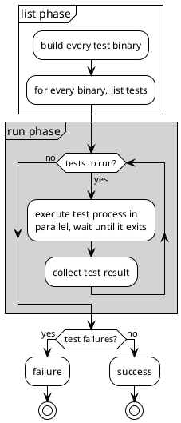

# Shipping TiKV with Cargo

Some thoughts and tips on how we use Cargo to ship TiKV.

[DONGPO LIU](https://github.com/0xPoe)

<div @click="$slidev.nav.next" class="mt-12 py-1" hover:bg="white op-10">
  Press Space to Start <carbon:arrow-right />
</div>

<div class="abs-br m-6 text-xl">
  <a href="https://github.com/0xPoe/tidb-analyze.slide" target="_blank" class="slidev-icon-btn">
    <carbon:logo-github />
  </a>
</div>

<!--
Alright, let's get started!

Thanks for joining me today.

Today I'm going to share with you some thoughts and tips on how we use Cargo to ship TiKV, a distributed transactional key-value database.

-->

---
layout: intro
class: pl-25
glowSeed: 14
transition: slide-up
---

<div text-5xl >Dongpo Liu</div>
<div op50 tracking-wide text-xl mt1 font-zh>刘东坡</div>

<div class="[&>*]:important-leading-10 opacity-80 mt5">
Senior Database Kernel Engineer@PingCAP <br/>
Cargo Maintainer@Rust<br/>
</div>

<div mt-10 w-min flex="~ gap-1" items-center justify-center>
  <div i-ri-user-3-line op50 ma text-xl />
  <div><a href="https://0xpoe.dev" target="_blank" class="border-none! font-300">0xPoe.dev</a></div>
  <div i-ri-github-line op50 ma text-xl ml4/>
  <div><a href="https://github.com/0xPoe" target="_blank" class="border-none! font-300">0xPoe</a></div>
  <div i-ri-linkedin-line op50 ma text-xl ml4/>
  <div ws-nowrap><a href="https://www.linkedin.com/in/dongpo-liu" target="_blank" class="border-none! font-300">Dongpo Liu</a></div>
</div>


<!--
Let me introduce myself first.
I'm Dongpo, a senior database kernel engineer at PingCAP, the company behind TiDB and TiKV. All our products are open source. So feel free to check them out.
I'm also a big believer in Open Source and I help maintain Cargo.
I'm pretty interested in distributed systems, databases, and dev tools. You can find me on the internet via these links. 
-->

---
transition: slide-up
layout: center
---

<div text-6xl fw100>
  Agenda
</div>

<br>

<div class="grid grid-cols-[3fr_2fr] gap-4">
  <div class="border-l border-gray-400 border-opacity-25 !all:leading-12 !all:list-none my-auto">

  - TiKV Project Overview
  - 6 Tips
  - Q&A

  </div>
</div>

<!--
Here's the agenda for today's talk.
First, I'll give a brief overview of the TiKV project.
Then, I'll share 6 tips on how we use Cargo to ship TiKV.
Finally, we'll have a Q&A session where you can ask any questions you may have.
-->

---
transition: slide-left
layout: center
---

# TiKV Project Overview

<!--
Let's start with a brief overview of the TiKV project.
-->


---
transition: slide-left
---

# A distributed Transactional KV Database

Cluster Overview


<!--
TiKV is a distributed, transactional key-value database. Under the hood, it uses Raft to keep data consistent across nodes.
Here is a typical TiKV cluster architecture. A cluster is made up of multiple TiKV nodes that store the data. Each node runs several Raft groups to replicate data across the cluster. The Placement Driver (PD) manages metadata and schedules the Raft groups.
Because TiKV targets high performance and low latency, it is implemented in Rust. The project started in 2016. Next, let’s zoom in on a single TiKV instance.
-->

---
transition: slide-left
---

# A distributed Transactional KV Database

Instance Deatails


<!--
Under the hood, TiKV uses RocksDB as its storage engine. If you look at our other components, like TiDB, you’ll see we use Go for most of them.
Since we rely heavily on RocksDB, Go wasn’t a great fit. At the same time, our co‑founders were big fans of Rust, so we chose Rust for TiKV.
That choice was challenging because Rust was still young and the ecosystem wasn’t mature. We had to build a lot of pieces from scratch.
-->


---
transition: slide-left
---

# TiKV Community

- [jemallocator](https://github.com/tikv/jemallocator)
- [rust-prometheus](https://github.com/tikv/rust-prometheus)
- [raft-rs](https://github.com/tikv/raft-rs)
- [pprof-rs](https://github.com/tikv/pprof-rs)
- [grpc-rs](https://github.com/tikv/grpc-rs)
- [fastrace](https://github.com/fast/fastrace)
- [fail-rs](https://github.com/tikv/fail-rs)

<!--
As you can see, we’ve contributed a lot to the Rust ecosystem, especially in systems programming and distributed systems.
Several of these projects are widely used in the Rust community, and we’re proud to have had a positive impact.
Please feel free to check them out.
-->


---
transition: slide-left
---

# TiKV

<div class="grid grid-cols-3 gap-8 text-center mx-auto w-fit mt-32">
  <div>
    <div class="text-5xl font-bold">500K+</div>
    <div class="text-sm opacity-75">lines of Rust</div>
  </div>
  <div>
    <div class="text-5xl font-bold">83</div>
    <div class="text-sm opacity-75">crates</div>
  </div>
  <div>
    <div class="text-5xl font-bold">600+</div>
    <div class="text-sm opacity-75">dependencies</div>
  </div>
</div>

<!--
TiKV has over 500,000 lines of Rust code, organized into 83 crates.
It also has 600+ dependencies, which we manage with Cargo. It’s fair to say Cargo plays a crucial role in our development workflow.
Now, let’s dive into five tips for shipping TiKV with Cargo and managing a project at this scale.
-->

---
transition: slide-up
layout: center
---

# 6 Tips for Shipping TiKV with Cargo


---
transition: slide-left
---

# Always check in `Cargo.lock` [^1]

1. For applications, always check in `Cargo.lock` to ensure reproducible builds.
2. For libraries, also check in `Cargo.lock` to ensure consistent dependency resolution across different environments. [^2] [^3]

<br/>

[^1]: [tikv#4](https://github.com/tikv/tikv/commit/c9b10c33ab2a94f816b00c2d093334434daa1082)
[^2]: [cargo#12382](https://github.com/rust-lang/cargo/pull/12382)
[^3]: [cargo#8728](https://github.com/rust-lang/cargo/issues/8728)

<!--
The first tip is to always check in the `Cargo.lock` file.
For applications, this is standard practice to ensure reproducible builds. TiKV is definitely an application, even though it also contains libraries, so we committed `Cargo.lock` from the start.
This ensures everyone uses the same dependency versions and avoids surprises during builds.

Cargo has also updated its guidance for libraries. Today, both applications and libraries are advised to check in `Cargo.lock`, which helps keep dependency resolution consistent across environments.

Historically, the main reason to skip `Cargo.lock` in libraries was to test against the latest dependencies. But that can cause unexpected breakages when a dependency releases a new version. By checking in `Cargo.lock`, we avoid that risk and keep control over our dependency set. For example, CI won’t suddenly fail because an upstream release introduced breaking changes.

When you do want to test against the newest dependencies, set up a separate CI job that periodically updates dependencies and runs tests. That way, you can catch issues early without disrupting the main workflow.
-->

---
transition: slide-left
---


# Always check in `Cargo.lock` 

Check latest dependencies regularly

```yaml {all|5}
jobs:
  latest_deps:
    name: Latest Dependencies
    runs-on: ubuntu-latest
    continue-on-error: true
    steps:
      - uses: actions/checkout@v3
      - run: rustup update stable && rustup default stable
      - run: cargo update --verbose
      - run: cargo build --verbose
      - run: cargo test --verbose
```

<!--
Here’s a GitHub Actions workflow that checks out the code, updates dependencies, builds the project, and runs tests.

You can also set `continue-on-error: true` so this job won’t fail the whole workflow if something breaks. That lets you monitor dependency updates without disrupting the main CI pipeline or blocking merges.
-->

---
transition: slide-left
---

# Workspace inheritance

The `package` table [^1]

```toml
# [PROJECT_DIR]/Cargo.toml
[workspace]
members = ["bar", "baz"]

[workspace.package]
authors = ["Nice Folks"]
homepage = "https://example.com"
rust-version = "1.70"
publish = false
```

````md magic-move
```toml
# [PROJECT_DIR]/bar/Cargo.toml
[package]
name = "bar"
authors = ["Nice Folks"]
homepage = "https://example.com"
rust-version = "1.70"
publish = false
```

```toml
# [PROJECT_DIR]/bar/Cargo.toml
[package]
name = "bar"
authors.workspace = true
homepage.workspace = true
rust-version.workspace = true
publish.workspace = true
```
````

[^1]: [Cargo Book: Workspace Package Table](https://doc.rust-lang.org/cargo/reference/workspaces.html#the-package-table)

<!--
The second tip is to use workspace inheritance for the `package` table.
By defining common fields in the workspace `Cargo.toml`, you avoid duplication and keep all member crates consistent.
Before workspace inheritance, you had to repeat fields like `authors`, `homepage`, `rust-version`, and `publish` in every crate’s `Cargo.toml`.
Now you can define them once in the workspace `Cargo.toml`, and member crates inherit them with `workspace = true`.
This simplifies maintenance and reduces the risk of inconsistencies.
-->

---
transition: slide-left
---

# Workspace inheritance

The `dependencies` table [^1]

```toml
# [PROJECT_DIR]/Cargo.toml
[workspace]
members = ["foo", "bar"]
[workspace.dependencies]
cc = "1.0.73"
rand = "0.8.5"
regex = { version = "1.6.0", default-features = false, features = ["std"] }
tracing = "0.1.37"

# [PROJECT_DIR]/foo/Cargo.toml
[dependencies]
tracing = { workspace = true }

# [PROJECT_DIR]/bar/Cargo.toml
[dependencies]
tracing = { workspace = true, default-features = false } # warning: default-features ignored
```


````md magic-move

```toml
# [PROJECT_DIR]/bar/Cargo.toml

[dependencies]
regex = { version = "1.6.0", features = ["unicode"] }
[build-dependencies]
cc = "1.0.73"
[dev-dependencies]
rand = "0.8.5"
```

```toml
# [PROJECT_DIR]/bar/Cargo.toml

[dependencies]
regex = { workspace = true, features = ["unicode"] }
[build-dependencies]
cc.workspace = true
[dev-dependencies]
rand.workspace = true
```
````
[^1]: [Cargo Book: Workspace Dependency Table](https://doc.rust-lang.org/cargo/reference/workspaces.html#the-dependencies-table)

<!--
Similarly, you can use workspace inheritance for the `dependencies` table.
This is especially helpful when multiple crates share the same dependencies. It reduces the burden of updating versions across crates.
Even for tools like Renovate or Dependabot, dependency updates become much easier to manage.
-->


---
transition: slide-left
---

# Workspace inheritance

A known issue [^1]


```toml
# [PROJECT_DIR]/Cargo.toml
[workspace]
members = ["foo", "bar"]
[workspace.dependencies]
cc = "1.0.73"
rand = "0.8.5"
regex = { version = "1.6.0", default-features = false, features = ["std"] }
tracing = "0.1.37"

# [PROJECT_DIR]/foo/Cargo.toml
[dependencies]
tracing = { workspace = true }

# [PROJECT_DIR]/bar/Cargo.toml
[dependencies]
tracing = { workspace = true, default-features = false } # warning: default-features ignored
```

[^1]: [cargo#12162](https://github.com/rust-lang/cargo/issues/12162)

<!--
One caveat with workspace dependency inheritance is that you can’t override fields like `default-features` or `features` when inheriting.
If you try, Cargo emits a warning and ignores the override.
This is a known limitation tracked in this GitHub issue.
For now, if you need to customize those fields, disable them in the workspace and enable them per crate.
-->


---
transition: slide-left
---

# Git Dependencies

`-Zgit=shallow-deps` unstable feature [^1]

| Command | User Time | System Time | Total |
|---------|-----------|-------------|-------|
| `cargo build` | 1013.69s | 152.69s | 3:27.03 |
| `cargo build -Zgit=shallow-deps` | 1017.79s | 152.84s | 2:43.67 |


```bash {*}{maxHeight:'150px'}
    Updating git repository `https://github.com/rust-lang/cmake-rs`
    Updating git repository `https://github.com/tikv/fs2-rs`
    Updating git repository `https://github.com/pingcap/rust-protobuf`
    Updating git submodule `https://github.com/google/protobuf`
    Updating git submodule `https://github.com/google/benchmark.git`
    Updating git repository `https://github.com/tikv/raft-rs`
    Updating git repository `https://github.com/tikv/rust-snappy.git`
    Updating git submodule `https://github.com/google/snappy.git`
    Updating git repository `https://github.com/tikv/sysinfo`
    Updating git repository `https://github.com/tikv/tame-oauth`
    Updating git repository `https://github.com/pingcap/kvproto.git`
    Updating git repository `https://github.com/tikv/raft-engine.git`
    Updating git repository `https://github.com/tikv/slog-global.git`
    Updating git repository `https://github.com/tikv/tokio`
    Updating git repository `https://github.com/tikv/yatp.git`
    Updating git repository `https://github.com/tikv/procinfo-rs`
    Updating git repository `https://github.com/tikv/tracing-active-tree.git`
    Updating git repository `https://github.com/tikv/rust-rocksdb.git`
    Updating git submodule `https://github.com/tikv/rocksdb.git`
    Updating git submodule `https://github.com/tikv/titan.git`
    Updating git repository `https://github.com/tikv/encoding_rs.git`
    Updating git repository `https://github.com/pingcap/tipb.git`
```

[^1]: [git-shallow-deps](https://doc.rust-lang.org/cargo/reference/unstable.html#git)

---
transition: slide-left
---

# nextest-rs/nextest [^1]

tokio: 1647 tests in 228 binaries [^2]

| Command | User Time | System Time | Total |
|---------|-----------|-------------|-------|
| `cargo test` | 106.31s | 50.83s | 236.03s |
| `cargo nextest run` | 15.46s | 6.52s | <span v-mark="{ color: 'green', type: 'circle' }">5.92s</span> |

[^1]: [nextest](https://nexte.st/)
[^2]: [tokio](https://github.com/tokio-rs/tokio)

<!--
The third tip is to use nextest for running tests.
Nextest is a community tool that speeds up test execution by running tests in parallel and optimizing the overall test process.

Take Tokio as an example. It has 1,647 tests across 228 binaries.
With `cargo test`, it took over 236 seconds. With `cargo nextest run`, it finished in just under 6 seconds.

That kind of speedup is huge for large projects. In TiKV we have more than 4,000 tests, so nextest has been a game‑changer for our CI times.
-->


---
transition: slide-left
layout: two-cols-header
---

# Why `cargo test` is slow?

::left::

<div style="margin-top: -2rem; display: flex; justify-content: center;">

```plantuml {scale: 0.8}
@startuml
!theme plain
start
:build every test binary;

while (binaries to run?) is (yes)
  :run binary, wait until it exits; <<#LightGray>>
  if (exit code 0?) then (yes)
  else (no)
    :failure;
    stop
  endif
endwhile (no)

:success;
stop
@enduml
```
</div>

::right::

<div style="margin-top: -2rem; display: flex; justify-content: center;">



</div>

<!--
`cargo test` is slower because it builds each test binary and runs them sequentially. Each binary runs in its own process, and Cargo waits for one to finish before starting the next.
Within a single process, tests can still run in parallel.
Nextest separates listing from execution. It first builds all test binaries and lists the tests they contain.
Then it runs tests in parallel across multiple processes and collects results as they complete.
So of course nextest is faster! It seems we can blindly trust nextest for all out projects, right?
-->


---
transition: slide-left
---

# Surprise!

cargo: 4216 tests in 3 binaries 

| Command | User Time | System Time | Total |
|---------|-----------|-------------|-------|
| `cargo test` | 523.01s | 431.60s | 324.46s |
| `cargo nextest run` | 721.57s | 464.16s |  <span v-mark="{ color: 'red', type: 'circle' }">329.90s</span> |

<br/>

<div class="bg-white text-black p-2 rounded font-mono text-sm">
<span class="text-red-600">█ Summary</span> [ 329.395s] 4216 tests run: 4163 <span class="text-green-600">passed</span>, 53 <span class="text-red-600">failed</span>, 36 <span class="text-yellow-600">skipped</span>
</div>

<br/>

1. Most tests are concentrated in a few binaries.
2. Cargo's tests rely on shared state, which causes failures when run in parallel across processes.

<!--
Interestingly, in Cargo itself, nextest can be slower than `cargo test`.

That’s because most Cargo tests are end‑to‑end integration tests concentrated in just a few binaries.
When nextest runs them in parallel across processes, they can interfere with each other due to shared state, which leads to failures.
And since there aren’t many binaries, cross‑process parallelism doesn’t help much.
So whether nextest is faster depends on your test structure. If most tests are unit tests spread across many binaries, it will likely speed things up. But if you have just a few integration-test binaries, it might not help. It may even break tests that rely on shared state.
-->


---
transition: slide-left
layout: two-cols-header
---

# Integration Tests

Put all integration tests in a single binary


::left::


<div class="mx-2">

````md magic-move {at:1}
```rust {1,8}
# tests/test1.rs
#[test]
fn test_addition() {
    let sum = 2 + 2;
    assert_eq!(sum, 4);
}

# tests/test2.rs
#[test]
fn test_subtraction() {
    let difference = 5 - 3;
    assert_eq!(difference, 2);
}
```

```rust {1-3,5,12}
# tests/testsuite/main.rust
mod test1;
mod test2;

# tests/testsuite/test1.rs
#[test]
fn test_addition() {
    let sum = 2 + 2;
    assert_eq!(sum, 4);
}

# tests/testsuite/test2.rs
#[test]
fn test_subtraction() {
    let difference = 5 - 3;
    assert_eq!(difference, 2);
}
```
````
</div>

::right::

<div class="mx-2">

````md magic-move {at:1}
```bash {11-13,17-19}
.
├── Cargo.lock
├── Cargo.toml
├── src
│   └── main.rs
├── target
│   ├── CACHEDIR.TAG
│   ├── debug
│   │   ├── build
│   │   ├── deps
│   │   │   ├── foo-a5cef2429056f6e1
│   │   │   ├── test1-4c1f19403823faf2
│   │   │   ├── test2-ede9a97ce0a4eb10
│   │   ├── examples
│   │   └── foo
│   └── tmp
└── tests
    ├── test1.rs
    └── test2.rs
```

```bash {11-13,16-20}
.
├── Cargo.lock
├── Cargo.toml
├── src
│   └── main.rs
├── target
│   ├── CACHEDIR.TAG
│   ├── debug
│   │   ├── build
│   │   ├── deps
│   │   │   ├── foo-a5cef2429056f6e1
│   │   │   ├── foo-e471945388faef79
│   │   │   └── testsuite-c27e06ab2ed00b25
│   │   ├── examples
│   │   └── foo
└── tests
    └── testsuite
        ├── main.rs
        ├── test1.rs
        └── test2.rs
```
````
</div>

---
transition: slide-left
---

# Linters

Clippy [^1]

```toml
[[disallowed-methods]]
path = "std::thread::Builder::spawn"
reason = """
Wrapper function `<std::thread::Builder as tikv_util::sys::thread::StdThreadBuildWrapper>::spawn_wrapper`
should be used instead, refer to https://github.com/tikv/tikv/pull/12442 for more details.
"""

[[disallowed-types]]
path = "openssl::cipher::Cipher::fetch"
reason = """
When a Some(...) value was passed to the properties argument of openssl::cipher::Cipher::fetch, \
a use-after-free would result. See RUSTSEC-2025-0022
"""
```


[^1]: [Clippy Disallowing Methods and Types](https://rust-lang.github.io/rust-clippy/master/index.html#disallowed_methods)


<!--
The next tip is to use linters as much as possible.
I believe most of you are familiar with Clippy and use it daily.
But I want to share an advanced feature of Clippy.
In TiKV, we use Clippy’s disallowed methods and types to enforce coding standards.
For example, we don’t allow direct use of `std::thread::Builder::spawn`. Instead, we provide a wrapper that adds extra functionality.
This is useful when you want to enforce team‑wide standards or prevent the use of APIs you don’t recommend.
-->


---
transition: slide-left
---

# Linters

Cargo Deny [^1]

```toml
[licenses]
version = 2
private = { ignore = false }
allow = ["0BSD", "Apache-2.0", "BSD-3-Clause", "CC0-1.0", "ISC", "MIT", "Zlib", "Unicode-3.0"]
exceptions = [
    { name = "unicode-ident", allow = ["Unicode-DFS-2016"] },
    { name = "slog-json", allow = ["MPL-2.0"] },
    { name = "smartstring", allow = ["MPL-2.0"] },
    { name = "inferno", allow = ["CDDL-1.0"] },
]

[sources]
unknown-git = "deny"
unknown-registry = "deny"
allow-org = { github = ["tikv", "pingcap", "rust-lang"] }
```

[^1]: [Cargo Deny](https://embarkstudios.github.io/cargo-deny/)


<!--
Another powerful linter is Cargo Deny.
As an open-source project, TiKV has strict requirements on dependency licenses.
With Cargo Deny, we define allowed licenses and automatically check dependencies against that list.

It also helps enforce sourcing policies, such as only allowing dependencies from certain organizations.

We also use it to monitor security vulnerabilities in dependencies. The documentation has more details.
-->

---
transition: slide-left
---

# Linters

Lints inheritance [^1]

```toml
# [PROJECT_DIR]/Cargo.toml
[workspace]
members = ["crates/*"]

[workspace.lints.rust]
unsafe_code = "forbid"
```

````md magic-move
```toml
# [PROJECT_DIR]/crates/bar/Cargo.toml
[package]
name = "bar"
version = "0.1.0"

[lints.rust]
unsafe_code = "forbid"
```

```toml
# [PROJECT_DIR]/crates/bar/Cargo.toml
[package]
name = "bar"
version = "0.1.0"

[lints]
workspace = true
```
````

[^1]: [Cargo Book: Workspace Lints Table](https://doc.rust-lang.org/cargo/reference/workspaces.html#the-lints-table)

<!--
Furthermore, Cargo now supports lints inheritance in workspaces.
You can define linting rules at the workspace level, and member crates can inherit them with `workspace = true`.
This keeps linting consistent across all crates and reduces duplication.
-->


---
transition: slide-left
layout: two-cols-header
---

# Linters

Cargo Linting System is coming soon! [^1]

<div>

```toml
[package]
name = "foo"
edition = "2021"
[dependencies]
dep = "1.0"
[lints.cargo]
implicit_minimum_version_req = "warn"
```

</div>

<br/>

<div>

<pre class="bg-white text-dark-800 p-2 rounded font-mono text-xs border border-gray-300" style="white-space: pre;"><span class="text-yellow">warning:</span> dependency version requirement without an explicit minimum version
<span class="text-blue"> --></span> Cargo.toml:6:9
<span class="text-blue">  |</span>
<span class="text-blue">6 |</span> serde = "1.0"
<span class="text-blue">  |</span><span class="text-yellow">          ^^^^^ missing full version components</span>
<span class="text-blue">  |</span>
<span class="text-cyan">help:</span> consider specifying full `major.minor.patch` version components
<span class="text-blue">  |</span>
<span class="text-blue">6 |</span> serde = "1.0<span class="text-green">.0</span>"
<span class="text-blue">  |</span><span class="text-green">              ++</span>
</pre>

</div>

[^1]: [Cargo Linting System](https://github.com/rust-lang/cargo/issues/12235)

<!--
Looking ahead, Cargo is working on a built‑in linting system.
It will let you define lint rules directly in `Cargo.toml`, similar to Clippy but focused on Cargo itself.
For example, you could warn about dependencies that don’t specify a full version requirement.
This should help catch common mistakes and enforce best practices at the package‑manager level.
The feature is still in development, but it looks promising. You can follow the GitHub issue for updates.
-->

---
transition: slide-left
---

# Cargo Profiles

A tiny historical mistake!

```toml {all|4}
[profile.dev]
opt-level = 0
debug = 0
codegen-units = 4
lto = false
incremental = true
panic = 'unwind'
debug-assertions = true
overflow-checks = false
rpath = false
```

<!--
The last tip is about Cargo profiles.
I’ll start with a small historical mistake we made early on.
Here is our dev profile — see if you can spot it.
We avoided optimizations in dev builds to speed up compile times.
We also disabled debug info to reduce binary size.
`codegen-units` controls parallel code generation. More units usually mean faster builds but worse runtime performance.
-->

---
transition: slide-left
---


# Cargo Profiles - `codegen-units`

A tiny historical mistake!

| codegen-units | Dev Build Time |
|---------------|------------|
| 4 [^1][^2]             | 3:11       |
| 256[^3]          |  <span v-mark="{ color: 'green', type: 'circle' }">2:55</span>   |


[^1]: [2014](https://github.com/rust-lang/rust/commit/cf672850)
[^2]: [2016](https://github.com/tikv/tikv/pull/1393/changes)
[^3]: [2020](https://github.com/rust-lang/rust/pull/70156)

<!--
The mistake was setting `codegen-units = 4`. Today the default is 256, which can speed up builds even more.
We set it this way because back in 2014, the Rust compiler default was 1, which led to long build times.
In 2016, we bumped it to 4 to speed things up.
Over time, the compiler improved build times with incremental compilation, and the default codegen units increased to 256 in 2020.
So usually you don’t need to set these options manually anymore — Cargo’s defaults are good enough.
If you do tweak them, make sure to revisit them periodically as the compiler evolves.
-->

---
transition: slide-left
---

# Cargo Profiles - `debug`
A cmake-rs issue [^1]


```toml {all|2,4-6}
[profile.dev]
debug = 0
...
[profile.dev.package.librocksdb_sys]
debug = false
opt-level = 1
[profile.dev.package.tests]
debug = 1
opt-level = 1
```

| debug | Build Time | Binary Size |
|-------|------------|-------------|
| true | 3:21 | 599M |
| 0 | **3:00** |  <span v-mark="{ color: 'green', type: 'circle' }">478M</span> |

[^1]: [cmake-rs#79](https://github.com/rust-lang/cmake-rs/issues/79#issuecomment-494676960)

<!--
Another interesting story is about the `debug` option.
As I mentioned earlier, we use RocksDB as our storage engine, which means we compile a lot of C++ code via cmake-rs.

We wanted to reduce the binary size of our dev builds, but even after setting `debug = 0`, the binaries were still large.

It turned out cmake-rs was forcing debug info for the C++ code, ignoring our Cargo profile settings.

You can see the discussion in this GitHub issue.

We worked around this by overriding the profile settings for the cmake-rs package specifically.

After enabling optimizations and disabling debug info, CMake respected the settings and produced smaller binaries.

As you can see, that reduced the binary size by more than 100MB and sped up build times as well.

You can also enable debug info only for test binaries, which is useful when debugging test failures.

That’s another trick you can use with Cargo profiles.
-->

---
transition: slide-up
layout: center
---

# Q&A

<br/>
<br/>


## Do you have any questions?

<!--
Alright, that wraps up my tips for shipping TiKV with Cargo.
I hope you found them useful.
Now I’d love to hear from you — any questions?
-->

---
transition: slide-up
layout: center
---

# Thank You!
