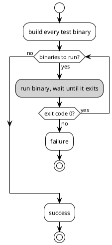
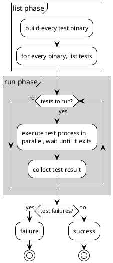

# Shipping TiKV with Cargo

Some thoughts and tips on how we use Cargo to ship TiKV.

[DONGPO LIU](https://github.com/0xPoe)

<div @click="$slidev.nav.next" class="mt-12 py-1" hover:bg="white op-10">
  Press Space to Start <carbon:arrow-right />
</div>

<div class="abs-br m-6 text-xl">
  <a href="https://github.com/0xPoe/tidb-analyze.slide" target="_blank" class="slidev-icon-btn">
    <carbon:logo-github />
  </a>
</div>

---
layout: intro
class: pl-25
glowSeed: 14
transition: slide-up
---

<div text-5xl >Dongpo Liu</div>
<div op50 tracking-wide text-xl mt1 font-zh>刘东坡</div>

<div class="[&>*]:important-leading-10 opacity-80 mt5">
Senior Database Kernel Engineer@PingCAP <br/>
Cargo Maintainer@Rust<br/>
</div>

<div mt-10 w-min flex="~ gap-1" items-center justify-center>
  <div i-ri-user-3-line op50 ma text-xl />
  <div><a href="https://0xpoe.dev" target="_blank" class="border-none! font-300">0xPoe.dev</a></div>
  <div i-ri-github-line op50 ma text-xl ml4/>
  <div><a href="https://github.com/0xPoe" target="_blank" class="border-none! font-300">0xPoe</a></div>
  <div i-ri-linkedin-line op50 ma text-xl ml4/>
  <div ws-nowrap><a href="https://www.linkedin.com/in/dongpo-liu" target="_blank" class="border-none! font-300">Dongpo Liu</a></div>
</div>


---
transition: slide-up
layout: center
---

<div text-6xl fw100>
  Agenda
</div>

<br>

<div class="grid grid-cols-[3fr_2fr] gap-4">
  <div class="border-l border-gray-400 border-opacity-25 !all:leading-12 !all:list-none my-auto">

  - TiKV Project Overview
  - 5 Tips
  - Q&A

  </div>
</div>


---
transition: slide-left
layout: center
---

# TiKV Project Overview


---
transition: slide-left
---

# A distributed Transactional KV Database


---
transition: slide-left
---

# TiKV Community

- [jemallocator](https://github.com/tikv/jemallocator)
- [rust-prometheus](https://github.com/tikv/rust-prometheus)
- [raft-rs](https://github.com/tikv/raft-rs)
- [pprof-rs](https://github.com/tikv/pprof-rs)
- [grpc-rs](https://github.com/tikv/grpc-rs)
- [fastrace](https://github.com/fast/fastrace)
- [fail-rs](https://github.com/tikv/fail-rs)


---
transition: slide-left
---

# TiKV

<div class="grid grid-cols-3 gap-8 text-center mx-auto w-fit mt-32">
  <div>
    <div class="text-5xl font-bold">500K+</div>
    <div class="text-sm opacity-75">lines of Rust</div>
  </div>
  <div>
    <div class="text-5xl font-bold">83</div>
    <div class="text-sm opacity-75">crates</div>
  </div>
  <div>
    <div class="text-5xl font-bold">600+</div>
    <div class="text-sm opacity-75">dependencies</div>
  </div>
</div>

---
transition: slide-up
layout: center
---

# 5 Tips for Shipping TiKV with Cargo


---
transition: slide-left
---

# Always check in `Cargo.lock` 

1. For applications, always check in `Cargo.lock` to ensure reproducible builds.
2. For libraries, also check in `Cargo.lock` to ensure consistent dependency resolution across different environments. [^1] [^2]

<br/>

[^1]: [cargo#12382](https://github.com/rust-lang/cargo/pull/12382)
[^2]: [cargo#8728](https://github.com/rust-lang/cargo/issues/8728)

---
transition: slide-left
---

# Workspace inheritance

The `package` table [^1]

```toml
# [PROJECT_DIR]/Cargo.toml
[workspace]
members = ["bar", "baz"]

[workspace.package]
authors = ["Nice Folks"]
homepage = "https://example.com"
rust-version = "1.70"
publish = false
```

````md magic-move
```toml
# [PROJECT_DIR]/bar/Cargo.toml
[package]
name = "bar"
authors = ["Nice Folks"]
homepage = "https://example.com"
rust-version = "1.70"
publish = false
```

```toml
# [PROJECT_DIR]/bar/Cargo.toml
[package]
name = "bar"
authors.workspace = true
homepage.workspace = true
rust-version.workspace = true
publish.workspace = true
```
````

[^1]: [Cargo Book: Workspace Package Table](https://doc.rust-lang.org/cargo/reference/workspaces.html#the-package-table)

---
transition: slide-left
---

# Workspace inheritance

The `dependencies` table [^1]

```toml
# [PROJECT_DIR]/Cargo.toml
[workspace]
members = ["bar", "baz"]

[workspace.dependencies]
cc = "1.0.73"
rand = "0.8.5"
regex = { version = "1.6.0", default-features = false, features = ["std"] }
```


````md magic-move

```toml
# [PROJECT_DIR]/bar/Cargo.toml

[dependencies]
regex = { version = "1.6.0", features = ["unicode"] }

[build-dependencies]
cc = "1.0.73"

[dev-dependencies]
rand = "0.8.5"
```

```toml
# [PROJECT_DIR]/bar/Cargo.toml

[dependencies]
regex = { workspace = true, features = ["unicode"] }

[build-dependencies]
cc.workspace = true

[dev-dependencies]
rand.workspace = true
```
````
[^1]: [Cargo Book: Workspace Dependency Table](https://doc.rust-lang.org/cargo/reference/workspaces.html#the-dependencies-table)

---
transition: slide-left
---

# nextest-rs/nextest [^1]

tokio: 1647 tests in 228 binaries [^2]

| Command | User Time | System Time | Total |
|---------|-----------|-------------|-------|
| `cargo test` | 115.61s | 66.09s | 181.70s |
| `cargo nextest run` | 15.57s | 6.55s | 22.12s |

[^1]: [nextest](https://nexte.st/)
[^2]: [tokio](https://github.com/tokio-rs/tokio)


---
transition: slide-left
layout: two-cols-header
---

# Why `cargo test` is slow?

::left::

<div style="margin-top: -2rem; display: flex; justify-content: center;">


</div>

::right::

<div style="margin-top: -2rem; display: flex; justify-content: center;">



</div>


---
transition: slide-left
---

# Surprise!

cargo: 4216 tests in 3 binaries 

| Command | User Time | System Time | Total |
|---------|-----------|-------------|-------|
| `cargo test` | 523.01s | 431.60s | 324.46s |
| `cargo nextest run` | 721.57s | 464.16s | 329.90s |

<br/>

<div class="bg-dark-800 text-white p-2 rounded font-mono text-sm">
<span class="text-red">█ Summary</span> [ 329.395s] 4216 tests run: 4163 <span class="text-green">passed</span>, 53 <span class="text-red">failed</span>, 36 <span class="text-yellow">skipped</span>
</div>

<br/>

1. Most tests are concentrated in a few binaries.
2. Cargo's tests rely on shared state, which causes failures when run in parallel across processes.

---
transition: slide-left
---

# Linters

Clippy [^1]

```toml
[[disallowed-methods]]
path = "std::thread::Builder::spawn"
reason = """
Wrapper function `<std::thread::Builder as tikv_util::sys::thread::StdThreadBuildWrapper>::spawn_wrapper`
should be used instead, refer to https://github.com/tikv/tikv/pull/12442 for more details.
"""

[[disallowed-types]]
path = "openssl::cipher::Cipher::fetch"
reason = """
When a Some(...) value was passed to the properties argument of openssl::cipher::Cipher::fetch, \
a use-after-free would result. See RUSTSEC-2025-0022
"""
```


[^1]: [Clippy Disallowing Methods and Types](https://rust-lang.github.io/rust-clippy/master/index.html#disallowed_methods)

---
transition: slide-left
---

# Linters

Cargo Deny [^1]

```toml
[licenses]
version = 2
private = { ignore = false }
allow = ["0BSD", "Apache-2.0", "BSD-3-Clause", "CC0-1.0", "ISC", "MIT", "Zlib", "Unicode-3.0"]
exceptions = [
    { name = "unicode-ident", allow = ["Unicode-DFS-2016"] },
    { name = "slog-json", allow = ["MPL-2.0"] },
    { name = "smartstring", allow = ["MPL-2.0"] },
    { name = "inferno", allow = ["CDDL-1.0"] },
]

[sources]
unknown-git = "deny"
unknown-registry = "deny"
allow-org = { github = ["tikv", "pingcap", "rust-lang"] }
```

[^1]: [Cargo Deny](https://embarkstudios.github.io/cargo-deny/)


---
transition: slide-left
---

# Linters

Lints inheritance [^1]

```toml
# [PROJECT_DIR]/Cargo.toml
[workspace]
members = ["crates/*"]

[workspace.lints.rust]
unsafe_code = "forbid"
```

````md magic-move
```toml
# [PROJECT_DIR]/crates/bar/Cargo.toml
[package]
name = "bar"
version = "0.1.0"

[lints.rust]
unsafe_code = "forbid"
```

```toml
# [PROJECT_DIR]/crates/bar/Cargo.toml
[package]
name = "bar"
version = "0.1.0"

[lints]
workspace = true
```
````

[^1]: [Cargo Book: Workspace Lints Table](https://doc.rust-lang.org/cargo/reference/workspaces.html#the-lints-table)


---
transition: slide-left
layout: two-cols-header
---

# Linters

Cargo Linting System is coming soon! [^1]

<div>

```toml
[package]
name = "foo"
edition = "2021"
[dependencies]
dep = "1.0"
[lints.cargo]
implicit_minimum_version_req = "warn"
```

</div>

<br/>

<div>

<pre class="bg-white text-dark-800 p-2 rounded font-mono text-xs border border-gray-300" style="white-space: pre;"><span class="text-yellow">warning:</span> dependency version requirement without an explicit minimum version
<span class="text-blue"> --></span> Cargo.toml:6:9
<span class="text-blue">  |</span>
<span class="text-blue">6 |</span> serde = "1.0"
<span class="text-blue">  |</span><span class="text-yellow">          ^^^^^ missing full version components</span>
<span class="text-blue">  |</span>
<span class="text-cyan">help:</span> consider specifying full `major.minor.patch` version components
<span class="text-blue">  |</span>
<span class="text-blue">6 |</span> serde = "1.0<span class="text-green">.0</span>"
<span class="text-blue">  |</span><span class="text-green">              ++</span>
</pre>

</div>

[^1]: [Cargo Linting System](https://github.com/rust-lang/cargo/issues/12235)

---
transition: slide-left
---

# Cargo Profiles

```toml
[profile.dev]
opt-level = 0
debug = 0
codegen-units = 4
lto = false
incremental = true
panic = 'unwind'
debug-assertions = true
overflow-checks = false
rpath = false

[profile.dev.package.librocksdb_sys]
debug = false
opt-level = 1

[profile.dev.package.tests]
debug = 1
opt-level = 1
```


---
transition: slide-up
layout: center
---

# Q&A

<br/>
<br/>

## Do you have any questions?

---
transition: slide-up
layout: center
---

# Thank You!
