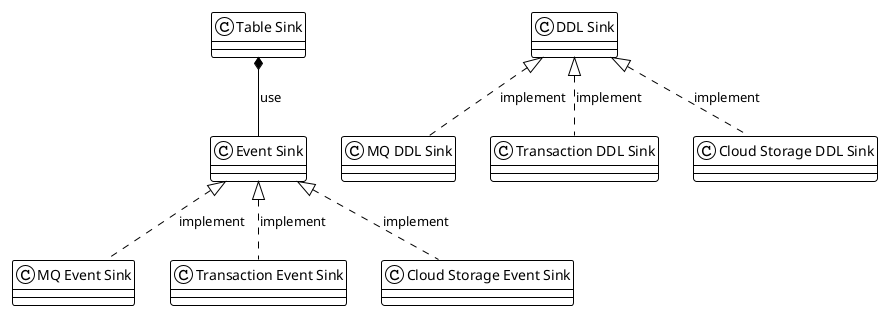
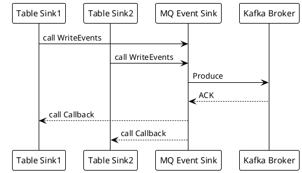
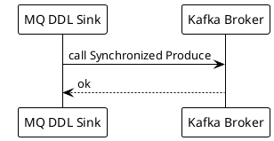

# TiCDC Kafka Sink Component

A Deep Dive

Based on TiCDC [v6.5.1](https://github.com/pingcap/tiflow/tree/v6.5.1)

<div class="pt-12">
  <span @click="$slidev.nav.next" class="px-2 py-1 rounded cursor-pointer" hover="bg-white bg-opacity-10">
    Begin <carbon:arrow-right class="inline"/>
  </span>
</div>

---
transition: slide-up
---

# Rustin Liu

<div class="leading-8 opacity-80">
PingCAPer.<br/>
Data Replication Team.<br/>
Cargo Contributor.<br/>
Rustup Maintainer.<br/>
</div>

<div my-10 grid="~ cols-[40px_1fr] gap-y4" items-center justify-center>
  <div i-ri-github-line op50 ma text-xl/>
  <div><a href="https://github.com/hi-rustin" target="_blank">hi-rustin</a></div>
  <div i-ri-twitter-line op50 ma text-xl/>
  <div><a href="https://twitter.com/hi_rustin" target="_blank">hi_rustin</a></div>
  <div i-ri-user-3-line op50 ma text-xl/>
  <div><a href="https://hi-rustin.rs" target="_blank">hi-rustin.rs</a></div>
</div>


<div flex="~ gap2">
</div>

---
transition: slide-up
layout: center
---

<div text-6xl fw100>
  Agenda
</div>

<br>

<div class="grid grid-cols-[3fr_2fr] gap-4">
  <div class="border-l border-gray-400 border-opacity-25 !all:leading-12 !all:list-none my-auto">

  - Sink Module Design
  - MQ Sink Deep Dive
  - Recommended Protocols
  - Q&A

  </div>
</div>

<style>
h1 {
  font-size: 4rem;
}
</style>

---
transition: slide-up
---

# Architecture Review

<br/>
<br/>


---
transition: slide-up
layout: two-cols
---

# Code Structure

::right::


<style>
h1 {
  display: flex;
  align-items: center;
  justify-content: center;
  height: 100%;
  text-align: center;
}
</style>

---
transition: slide-up
---

# Sink Module Abstract

<br/>
<br/>



<br/>

&nbsp;&nbsp;&nbsp;&nbsp;&nbsp;&nbsp;&nbsp;&nbsp;[Table Sink](https://github.com/pingcap/tiflow/tree/v6.5.1/cdc/sinkv2/tablesink)
· [Event Sink](https://github.com/pingcap/tiflow/blob/v6.5.1/cdc/sinkv2/eventsink/event_sink.go) · [DDL Sink](https://github.com/pingcap/tiflow/tree/v6.5.1/cdc/sinkv2/ddlsink) · [MQ Event Sink](https://github.com/pingcap/tiflow/tree/v6.5.1/cdc/sinkv2/eventsink/mq) · [Transaction Event Sink](https://github.com/pingcap/tiflow/tree/v6.5.1/cdc/sinkv2/eventsink/txn) · [Cloud Storage Event Sink](https://github.com/pingcap/tiflow/tree/v6.5.1/cdc/sinkv2/eventsink/cloudstorage)

---
transition: slide-up
layout: two-cols
---

<template v-slot:default>

# DML Data Flow
<br/>


&nbsp;&nbsp;&nbsp;&nbsp;[call WriteEvents](https://github.com/pingcap/tiflow/blob/7f561614a572a87ce8ac714e64dfb2668c20e20f/cdc/sinkv2/tablesink/table_sink_impl.go#L116)

&nbsp;&nbsp;&nbsp;&nbsp;[Produce](https://github.com/pingcap/tiflow/blob/7f561614a572a87ce8ac714e64dfb2668c20e20f/cdc/sinkv2/eventsink/mq/dmlproducer/kafka_dml_producer.go#L172)

&nbsp;&nbsp;&nbsp;&nbsp;[ACK](https://github.com/pingcap/tiflow/blob/7f561614a572a87ce8ac714e64dfb2668c20e20f/cdc/sinkv2/eventsink/mq/dmlproducer/kafka_dml_producer.go#L259)

&nbsp;&nbsp;&nbsp;&nbsp;[call Callback](https://github.com/pingcap/tiflow/blob/7f561614a572a87ce8ac714e64dfb2668c20e20f/cdc/sinkv2/eventsink/mq/dmlproducer/kafka_dml_producer.go#L261)

</template>

<template v-slot:right>

# DDL Data Flow
<br/>


&nbsp;&nbsp;&nbsp;&nbsp;[call Synchronized Produce](https://github.com/pingcap/tiflow/blob/7f561614a572a87ce8ac714e64dfb2668c20e20f/cdc/sinkv2/ddlsink/mq/mq_ddl_sink.go#L85)
</template>


---
transition: slide-up
---

# Sink Interface
<br/>
<br/>

```go {0|7|all}
package eventsink

// EventSink is the interface for event sink.
type EventSink[E TableEvent] interface {
	// WriteEvents writes events to the sink.
	// This is an asynchronously and thread-safe method.
	WriteEvents(events ...*CallbackableEvent[E]) error
	// Close closes the sink.
	Close() error
}
```

---
transition: slide-up
---

# MQ Event Sink
<br/>

```go{all|10|11|all}
// dmlSink is the mq sink.
// It will send the events to the MQ system.
type dmlSink struct {
	// id indicates this sink belongs to which processor(changefeed).
	id model.ChangeFeedID
	// protocol indicates the protocol used by this sink.
	protocol config.Protocol

	// eventRouter used to route events to the right topic and partition.
	eventRouter *dispatcher.EventRouter
	worker *worker
	// topicManager used to manage topics.
	// It is also responsible for creating topics.
	topicManager manager.TopicManager
}
```

[eventRouter](https://github.com/pingcap/tiflow/blob/v6.5.1/cdc/sink/mq/dispatcher/event_router.go)

[worker](https://github.com/pingcap/tiflow/blob/v6.5.1/cdc/sinkv2/eventsink/mq/worker.go)

---
transition: slide-up
---

# MQ Event Router
<br/>

```go{0|6|7|all}
// EventRouter is a router, it determines which topic and which partition
// an event should be dispatched to.
type EventRouter struct {
	defaultTopic string
	rules        []struct {
		topicDispatcher     topic.Dispatcher
		partitionDispatcher partition.Dispatcher
		...
	}
}
```

[topicDispatcher](https://github.com/pingcap/tiflow/blob/v6.5.1/cdc/sink/mq/dispatcher/topic/dispatcher.go)

[partitionDispatcher](https://github.com/pingcap/tiflow/tree/v6.5.1/cdc/sink/mq/dispatcher/partition)

---
transition: slide-up
---

# MQ Topic And Partition Dispatcher
Send data to multiple topics and partitions based on the table name.
<div>

```toml
dispatchers = [
    { matcher = ['test1.*', 'test2.*'], partition = "ts", topic = "hello_{schema}" },
    { matcher = ['test3.*', 'test4.*'], dispatcher = "rowid", topic = "{schema}_world" },
]
```
</div>
<br/>
<br/>
<div class="grid grid-cols-3 gap-4 items-center h-100">
  <div class="object-contain h-full of-hidden">
      <h1>Matcher</h1>
      <br/>
      <span>- *</span>
      <br/>
      <span>- ?</span>
      <br/>
      <span>- [a-z]</span>
      <br/>
      <span>- [!a-z]</span>
      <br/>
  </div>
  <div class="object-contain h-full of-hidden">
      <h1>Topic</h1>
      <br/>
      <span>- {schema}</span>
      <br/>
      <span>- {table}</span>
      <br/>
  </div>
  <div class="object-contain h-full of-hidden">
      <h1>Partition</h1>
      <br/>
      <span>- default</span>
      <br/>
      <span>- table</span>
      <br/>
      <span>- row_id</span>
      <br/>
      <span>- ts</span>
      <br/>

  </div>
</div>

---
transition: slide-up
---

# Why so many dispensers?
What is row level order?

```sql
CREATE TABLE `t` (`a` VARCHAR(255)
PRIMARY KEY);
Insert a = 2
Update a = 1 where a = 2
Insert a = 2
Update a = 3 where a = 2
```

| partition-1  | partition-2  | partition-3  |
| ------------ | ------------ | ------------ |
| Insert a = 2 | Insert a = 1 | Insert a = 3 |
| Delete a =2  |              |              |
| Insert a = 2 |              |              |
| Delete a =2  |              |              |

---
transition: slide-up
---

# Why so many dispensers?
We guarantee the order of the row level.

```sql
CREATE TABLE `t` (`a` VARCHAR(255)
PRIMARY KEY /*T![clustered_index] NONCLUSTERED */);
Insert a = 2
Update a = 1 where a = 2
Insert a = 2
Update a = 3 where a = 2
```


<h4>Disable Old Value: </h4>

| partition-1  | partition-2  | partition-3  |
| ------------ | ------------ | ------------ |
| Insert a = 2 | Insert a = 1 | Insert a = 3 |
| Delete a =2  |              |              |
| Insert a = 2 |              |              |
| Delete a =2  |              |              |


---
transition: slide-up
---

# Why so many dispensers?
We **can not** guarantee the order of the row level when the old value is enabled if the primary key is not clustered.

```sql
CREATE TABLE `t` (`b` VARCHAR(255)
PRIMARY KEY /*T![clustered_index] NONCLUSTERED */);
Insert a = 2
Update a = 1 where a = 2
Insert a = 2
Update a = 3 where a = 2
```

<h4>Enable Old Value: </h4>

| partition-1  | partition-2              | partition-3              |
| ------------ | ------------------------ | ------------------------ |
| Insert a = 2 | Update a = 1 where a = 2 | Update a = 3 where a = 2 |
| Insert a = 2 |                          |                          |
|              |                          |                          |
|              |                          |                          |

---
transition: slide-up
---

# MQ Sink Worker

```go
func (w *worker) run(ctx context.Context) (retErr error) {
	...

  // Spawn goroutines to encode events.
	g, ctx := errgroup.WithContext(ctx)
	g.Go(func() error {
		return w.encoderGroup.Run(ctx)
	})

  // Try to receive row events from the table sink.
	g.Go(func() error {
		if w.protocol.IsBatchEncode() {
			return w.batchEncodeRun(ctx)
		}
		return w.nonBatchEncodeRun(ctx)
	})

  // Try to send messages to the MQ system.
	g.Go(func() error {
		return w.sendMessages(ctx)
	})
	return g.Wait()
}
```

---
transition: slide-up
---

# MQ Sink Producer

```go
// DMLProducer is the interface for message producer.
type DMLProducer interface {
	// AsyncSendMessage sends a message asynchronously.
	AsyncSendMessage(
		ctx context.Context, topic string, partition int32, message *common.Message,
	) error

	// Close closes the producer and client(s).
	Close()
}
```
<br/>

# Go Client
We use:

[shopify/sarama](https://github.com/Shopify/sarama/wiki) (ticdc v6.5)

[segmentio/kafka-go](https://github.com/segmentio/kafka-go) (ticdc master)

---
transition: slide-up
---
# Encoder

```go
type EventBatchEncoder interface {
  ...
	// AppendRowChangedEvent appends the calling context, a row changed event and the dispatch
	// topic into the batch
	AppendRowChangedEvent(context.Context, string, *model.RowChangedEvent, func()) error
  ...
	// Build builds the batch and returns the bytes of key and value.
	// Should be called after `AppendRowChangedEvent`
	Build() []*common.Message
}
```

# Recommended Protocol
We recommend and officially support:

[Canal-JSON Protocol](https://docs.pingcap.com/tidb/dev/ticdc-canal-json)

[Avro Protocol](https://docs.pingcap.com/tidb/dev/ticdc-avro-protocol/)

---
transition: slide-up
---
# Canal-JSON

[SQL to Canal-JSON](https://github.com/pingcap/tiflow/tree/v6.5.1/cdc/sink/codec/canal)

<div class="grid grid-cols-2 gap-4 items-center h-100">
  <div class="object-contain">

```sql {0|all|0}
/*
Insert a row into table TEST.
*/
INSERT INTO TEST (NAME,AGE)
VALUES ('Jack',20);
```

```go{0|all|0}
type RowChangedEvent struct {
	StartTs  uint64
	CommitTs uint64
	RowID int64
	Table    *TableName
	ColInfos []rowcodec.ColInfo
	TableInfoVersion uint64
	ReplicaID    uint64
	Columns      []*Column
	PreColumns   []*Column
	IndexColumns [][]int
	ApproximateDataSize int64
}
```
  </div>
  <div class="object-contain w-full">

```json {0|all}
{
    "id": 0,
    "database": "test",
    "table": "TEST",
    "pkNames": [
        "NAME"
    ],
    "isDdl": false,
    "type": "INSERT",
    ...
    "ts": 2,
    ...
    "data": [
        {
            "NAME": "Jack",
            "AGE": "25"
        }
    ],
    "old": null
}
```

  </div>
</div>

---
transition: slide-up
---
# Avro

[Schema Registry](https://github.com/pingcap/tiflow/tree/v6.5.1/cdc/sink/codec/avro)

<div class="grid grid-cols-2 gap-4 items-center">
  <div class="object-contain">
<h2>Key: </h2>

```json{0|all|0}
{
    "name":"{{TableName}}",
    "namespace":"{{Namespace}}",
    "type":"record",
    "fields":[
        {{ColumnValueBlock}},
        {{ColumnValueBlock}},
    ]
}
```
  </div>
  <div class="object-contain w-full">
<h2>Value: </h2>

```json {0|all}
{
    "name":"{{TableName}}",
    "namespace":"{{Namespace}}",
    "type":"record",
    "fields":[
        {{ColumnValueBlock}},
        {{ColumnValueBlock}},
    ]
}
```

  </div>
</div>

```json {0|all|0}
{
    "name":"{{ColumnName}}",
    "type":{
        "connect.parameters":{
            "tidb_type":"{{TIDB_TYPE}}"
        },
        "type":"{{AVRO_TYPE}}"
    }
}
```

---
layout: center
class: text-center
---

# Learn More

[Documentations](https://docs.pingcap.com/tidb/dev/ticdc-overview) · [GitHub](https://github.com/pingcap/tiflow)  · [How to write a new sink](https://hi-rustin.rs/TiCDC-Sink-%E5%BC%80%E5%8F%91%E6%8C%87%E5%8D%97/)
