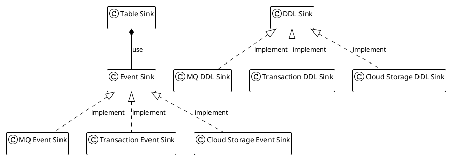
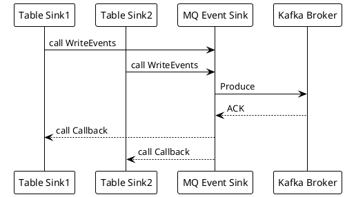
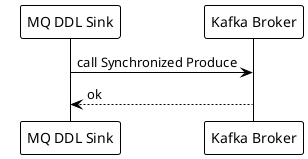

# TiCDC Kafka Sink Component

A Deep Dive

<div class="pt-12">
  <span @click="$slidev.nav.next" class="px-2 py-1 rounded cursor-pointer" hover="bg-white bg-opacity-10">
    Begin <carbon:arrow-right class="inline"/>
  </span>
</div>

---
transition: fade-out
---

# Rustin Liu

<div class="leading-8 opacity-80">
PingCAPer.<br/>
Data Replication Team.<br/>
Cargo Contributor.<br/>
Rustup Maintainer.<br/>
</div>

<div my-10 grid="~ cols-[40px_1fr] gap-y4" items-center justify-center>
  <div i-ri-github-line op50 ma text-xl/>
  <div><a href="https://github.com/hi-rustin" target="_blank">hi-rustin</a></div>
  <div i-ri-twitter-line op50 ma text-xl/>
  <div><a href="https://twitter.com/hi_rustin" target="_blank">hi_rustin</a></div>
  <div i-ri-user-3-line op50 ma text-xl/>
  <div><a href="https://hi-rustin.rs" target="_blank">hi-rustin.rs</a></div>
</div>


<div flex="~ gap2">
</div>

---
transition: slide-up
layout: center
---

<div text-6xl fw100>
  Agenda
</div>

<br>

<div class="grid grid-cols-[3fr_2fr] gap-4">
  <div class="border-l border-gray-400 border-opacity-25 !all:leading-12 !all:list-none my-auto">

  - Sink Module Design
  - MQ Sink Deep Dive
  - Avro Protocol
  - Canal-JSON Protocol
  - Q&A

  </div>
</div>

<style>
h1 {
  font-size: 4rem;
}
</style>

---
transition: fade-out
---

# Sink Module Abstract

<br/>
<br/>



---
transition: fade-out
layout: two-cols
---

<template v-slot:default>

# DML Data Flow
<br/>


</template>

<template v-slot:right>

# DDL Data Flow
<br/>


</template>

---
transition: slide-up
---

# Sink Interface
<br/>
<br/>

```go {0|7|all}
package eventsink

// EventSink is the interface for event sink.
type EventSink[E TableEvent] interface {
	// WriteEvents writes events to the sink.
	// This is an asynchronously and thread-safe method.
	WriteEvents(events ...*CallbackableEvent[E]) error
	// Close closes the sink.
	Close() error
}
```

---
transition: slide-up
---

# MQ Event Sink
<br/>
<br/>

```go{all|9|11|all}
// dmlSink is the mq sink.
// It will send the events to the MQ system.
type dmlSink struct {
	// id indicates this sink belongs to which processor(changefeed).
	id model.ChangeFeedID
	// protocol indicates the protocol used by this sink.
	protocol config.Protocol

	worker *worker
	// eventRouter used to route events to the right topic and partition.
	eventRouter *dispatcher.EventRouter
	// topicManager used to manage topics.
	// It is also responsible for creating topics.
	topicManager manager.TopicManager
}
```
---
transition: slide-up
---

# MQ Event Router
<br/>

```go
// EventRouter is a router, it determines which topic and which partition
// an event should be dispatched to.
type EventRouter struct {
	defaultTopic string
	rules        []struct {
		partitionDispatcher partition.Dispatcher
		topicDispatcher     topic.Dispatcher
		...
	}
}
```

---
transition: slide-up
---

# MQ Topic And Partition Dispatcher
<br/>
<div>

```toml
dispatchers = [
    { matcher = ['test1.*', 'test2.*'], partition = "ts", topic = "hello_{schema}" },
    { matcher = ['test3.*', 'test4.*'], dispatcher = "rowid", topic = "{schema}_world" },
]
```
</div>
<br/>
<br/>
<div class="grid grid-cols-2 gap-4 items-center h-100">
  <div class="object-contain h-full of-hidden">
      <h2>Topic</h2>
      <br/>
      <span>- matcher</span>
      <br/>
      <span>- {schema}</span>
      <br/>
      <span>- {partition}</span>
      <br/>
  </div>
  <div class="object-contain h-full of-hidden">
      <h2>Partition</h2>
      <br/>
      <span>- default</span>
      <br/>
      <span>- table</span>
      <br/>
      <span>- row_id</span>
      <br/>
      <span>- ts</span>
      <br/>

  </div>
</div>

---
transition: slide-up
---

# MQ Sink Worker

```go
func (w *worker) run(ctx context.Context) (retErr error) {
	....

	g, ctx := errgroup.WithContext(ctx)
	g.Go(func() error {
		return w.encoderGroup.Run(ctx)
	})
	g.Go(func() error {
		if w.protocol.IsBatchEncode() {
			return w.batchEncodeRun(ctx)
		}
		return w.nonBatchEncodeRun(ctx)
	})
	g.Go(func() error {
		return w.sendMessages(ctx)
	})
	return g.Wait()
}
```

---
layout: center
class: text-center
---

# Learn More

[Documentations](https://sli.dev) · [GitHub](https://github.com/slidevjs/slidev) · [Showcases](https://sli.dev/showcases.html)
