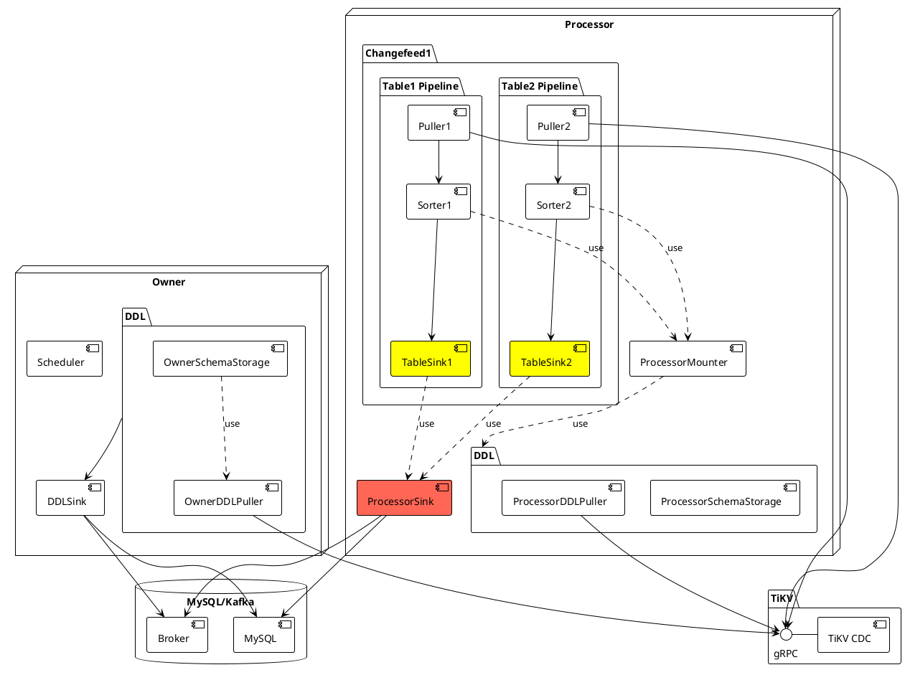
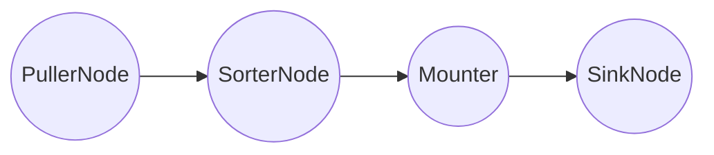
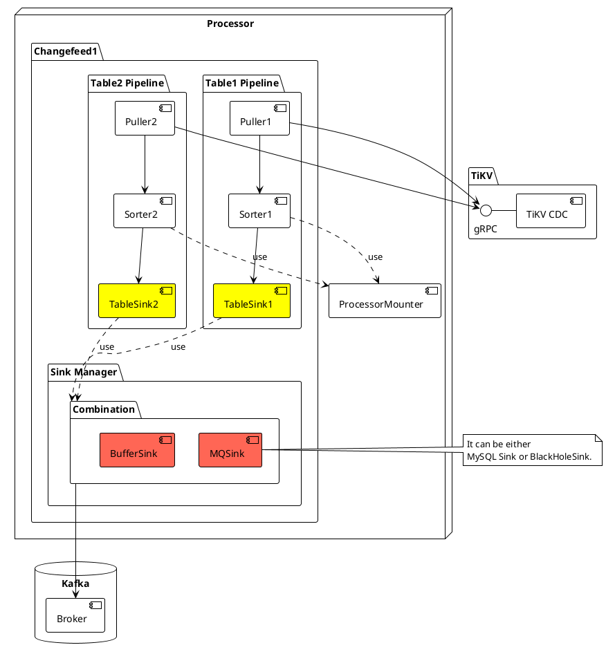
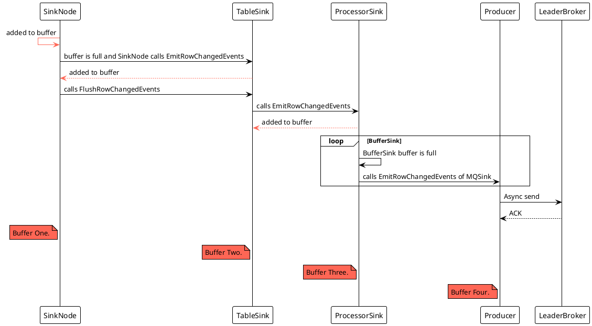
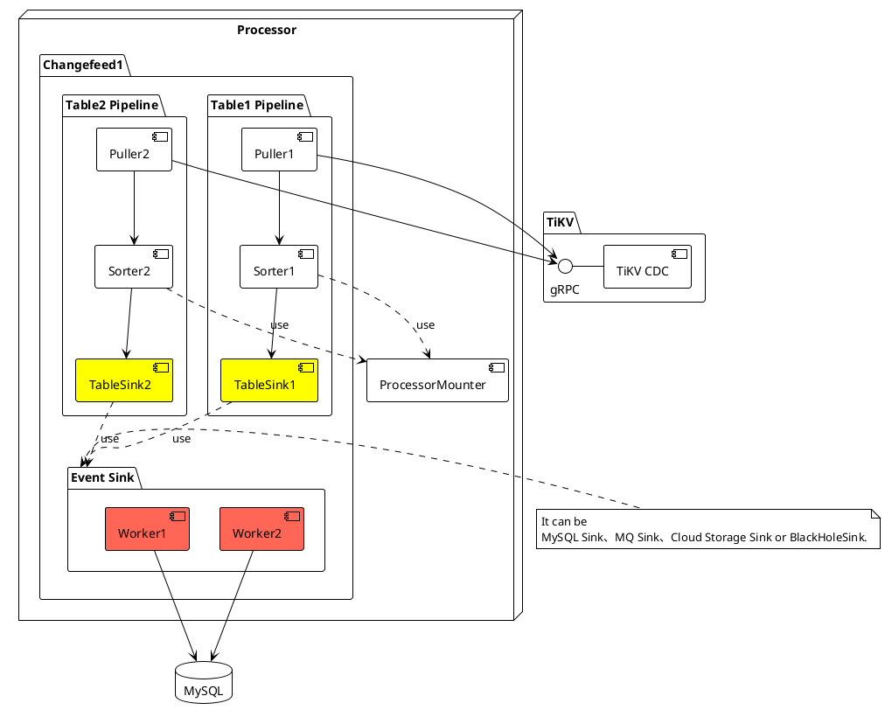
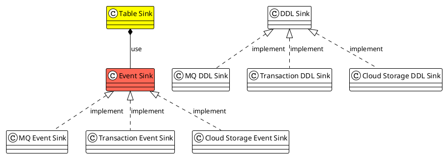
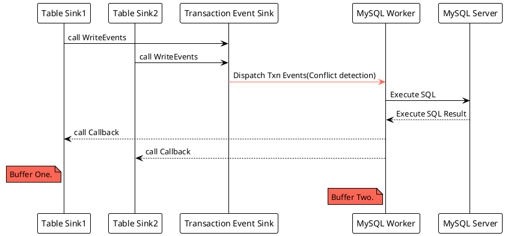

# TiCDC Sink Component

A Deep Dive

Based on TiCDC [v6.5.1](https://github.com/pingcap/tiflow/tree/v6.5.1)

  
    Begin <carbon:arrow-right class="inline"/>
  

---
transition: slide-up
---

# Rustin Liu

PingCAPer. 
Data Replication Team. 
Cargo Contributor. 
Rustup Maintainer. 

  

  
<a href="https://github.com/hi-rustin" target="_blank">hi-rustin</a>

  

  
<a href="https://twitter.com/hi_rustin" target="_blank">hi_rustin</a>

  

  
<a href="https://hi-rustin.rs" target="_blank">hi-rustin.rs</a>

---
transition: slide-up
layout: center
---

  Agenda

 

  

  - Architecture
  - Old Table Sink Module Design
  - New Table Sink Module Design
  - MySQL Sink Deep Dive
  - New Sink Metrics
  - Q&A

  

---
transition: slide-up
layout: center
---

# Architecture

---

# Architecture

- A TiCDC cluster has only one owner.
- A capture will have multiple processors.
- A processor can only process one changefeed.
- A changefeed can synchronize multiple tables.

---

# Table Pipeline

Each changefeed creates a processor, and each processor maintains multiple table pipelines.

### Pipeline
 
 

---
transition: slide-up
layout: center
---

# Old Sink Design

---

# Old Sink Design

---

# Old Data Sequence

## Row Change Data Sequence

---
transition: slide-up
layout: center
---

# New Sink Design

---

# New Sink Design

---
transition: slide-up
---

# Sink Module Abstract

 
 

 

&nbsp;&nbsp;&nbsp;&nbsp;&nbsp;&nbsp;&nbsp;&nbsp;[Table Sink](https://github.com/pingcap/tiflow/tree/v6.5.1/cdc/sinkv2/tablesink)
· [Event Sink](https://github.com/pingcap/tiflow/blob/v6.5.1/cdc/sinkv2/eventsink/event_sink.go) · [DDL Sink](https://github.com/pingcap/tiflow/tree/v6.5.1/cdc/sinkv2/ddlsink) · [MQ Event Sink](https://github.com/pingcap/tiflow/tree/v6.5.1/cdc/sinkv2/eventsink/mq) · [Transaction Event Sink](https://github.com/pingcap/tiflow/tree/v6.5.1/cdc/sinkv2/eventsink/txn) · [Cloud Storage Event Sink](https://github.com/pingcap/tiflow/tree/v6.5.1/cdc/sinkv2/eventsink/cloudstorage)

---
transition: slide-up
---

# New Data Sequence

## Row Change Data Sequence

 

