# TiCDC Sink Component

A Deep Dive

Based on TiCDC [v6.5.1](https://github.com/pingcap/tiflow/tree/v6.5.1)

<div class="pt-12">
  <span @click="$slidev.nav.next" class="px-2 py-1 rounded cursor-pointer" hover="bg-white bg-opacity-10">
    Begin <carbon:arrow-right class="inline"/>
  </span>
</div>

---
transition: slide-up
---

# Rustin Liu

<div class="leading-8 opacity-80">
PingCAPer.<br/>
Data Replication Team.<br/>
Cargo Contributor.<br/>
Rustup Maintainer.<br/>
</div>

<div my-10 grid="~ cols-[40px_1fr] gap-y4" items-center justify-center>
  <div i-ri-github-line op50 ma text-xl/>
  <div><a href="https://github.com/hi-rustin" target="_blank">hi-rustin</a></div>
  <div i-ri-twitter-line op50 ma text-xl/>
  <div><a href="https://twitter.com/hi_rustin" target="_blank">hi_rustin</a></div>
  <div i-ri-firefox-line op50 ma text-xl/>
  <div><a href="https://hi-rustin.rs" target="_blank">hi-rustin.rs</a></div>
</div>


<div flex="~ gap2">
</div>

---
transition: slide-up
layout: center
---

<div text-6xl fw100>
  Agenda
</div>

<br>

<div class="grid grid-cols-[3fr_2fr] gap-4">
  <div class="border-l border-gray-400 border-opacity-25 !all:leading-12 !all:list-none my-auto">

  - Architecture
  - Old & New Sink Module Design
  - Table Sink Deep Dive
  - MySQL Sink Deep Dive
  - Q&A

  </div>
</div>

---
transition: slide-up
layout: center
---

# Architecture

---
transition: slide-up
layout: center
---

<div class="arch">
<div>

# Architecture

</div>

<div
  class="relation"
>

- A TiCDC cluster has only one owner.
- A capture will have multiple processors.
- A processor can only process one changefeed.
- A changefeed can synchronize multiple tables.

</div>

<div>

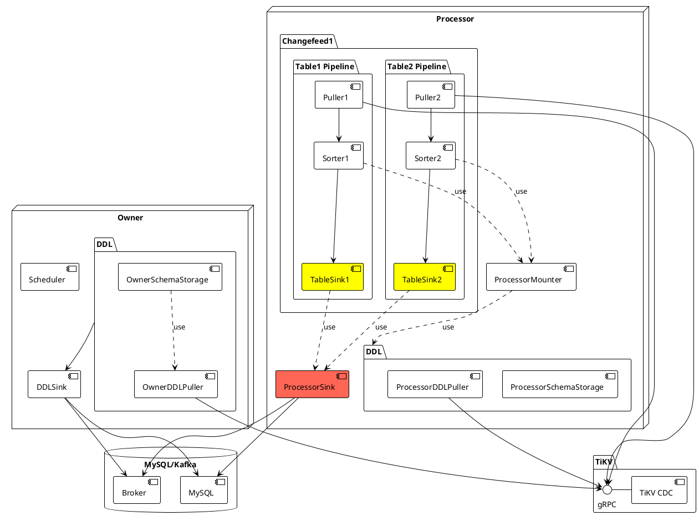

</div>
</div>

<style>
.arch {
  display: flex;
}

.arch img {
  margin-top: -80px;
}

.relation {
  position: absolute;
  z-index: 1;
  left: 120px;
  top: 60px;
  font-size: 12px;
}

h1 {
  background-color: #2B90B6;
  background-image: linear-gradient(45deg, #4EC5D4 10%, #146b8c 20%);
  background-size: 50%;
  -webkit-background-clip: text;
  -moz-background-clip: text;
  -webkit-text-fill-color: transparent;
  -moz-text-fill-color: transparent;
  writing-mode: vertical-rl;
  text-orientation: mixed;
}
</style>

---

# Table Pipeline

Each changefeed creates a processor, and each processor maintains multiple table pipelines.

### Pipeline
<br>
<br>

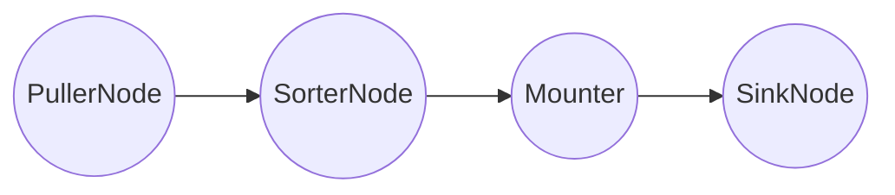

---
transition: slide-up
layout: center
---

# Old Sink Design

---

<div class="relation">

<div class="title">

# Old Sink Design

</div>
<div class="uml">

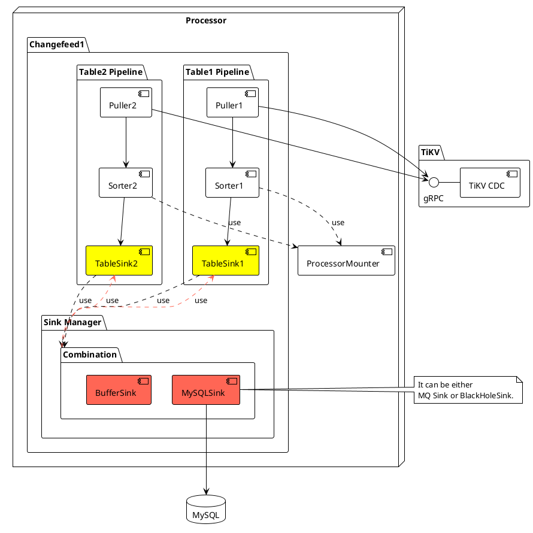

</div>
</div>

<style>
.relation {
  display: flex;
  justify-content: flex-start;
}

.relation img {
  height: 500px;
}

.relation .title {
  flex-grow: 4;
}

.relation .uml {
  flex-grow: 2;
}

h1 {
  background-color: #2B90B6;
  background-image: linear-gradient(45deg, #4EC5D4 10%, #146b8c 20%);
  background-size: 50%;
  -webkit-background-clip: text;
  -moz-background-clip: text;
  -webkit-text-fill-color: transparent;
  -moz-text-fill-color: transparent;
  writing-mode: vertical-rl;
  text-orientation: mixed;
}
</style>

---
transition: slide-up
---

<div class="arch">
<div>

# Old Sink Module Abstract

</div>

<div>
  <br/>
  <br/>
  <br/>

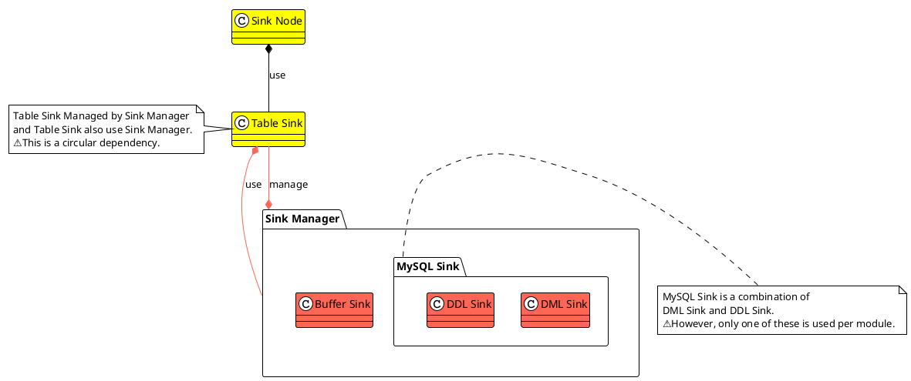

</div>
</div>

<style>
.arch {
  display: flex;
}

.arch img {
  margin-top: -80px;
}

h1 {
  background-color: #2B90B6;
  background-image: linear-gradient(45deg, #4EC5D4 10%, #146b8c 20%);
  background-size: 50%;
  -webkit-background-clip: text;
  -moz-background-clip: text;
  -webkit-text-fill-color: transparent;
  -moz-text-fill-color: transparent;
  writing-mode: vertical-rl;
  text-orientation: mixed;
}
</style>

---

# Old Data Sequence (Sync)

## Row Change Data Sequence

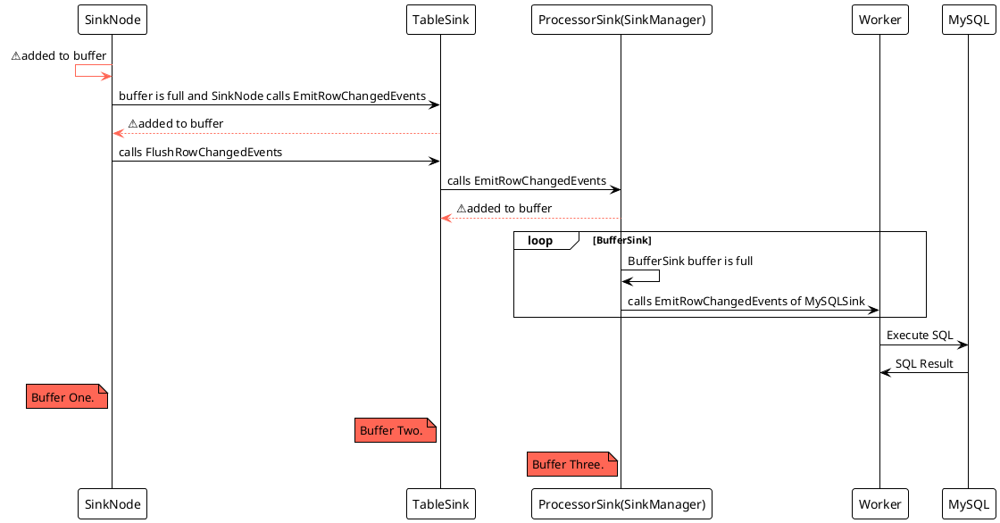

---
transition: slide-up
layout: two-cols
---

# Old Sink Module Abstract

```go
type Sink interface {
	// FIXME: some sink implementation is not thread-safety, but they should be.
	EmitRowChangedEvents(ctx context.Context, rows ...*model.RowChangedEvent) error

	// TryEmitRowChangedEvents is thread-safety and non-blocking.
	TryEmitRowChangedEvents(ctx context.Context, rows ...*model.RowChangedEvent) (bool, error)

	// FIXME: some sink implementation is not thread-safety, but they should be.
	EmitDDLEvent(ctx context.Context, ddl *model.DDLEvent) error

	// FlushRowChangedEvents flushes each row which of commitTs less than or
	// equal to `resolvedTs` into downstream.
	// FIXME: some sink implementation is not thread-safety, but they should be.
	FlushRowChangedEvents(ctx context.Context, tableID model.TableID, resolvedTs uint64) (uint64, error)

	// FIXME: some sink implementation is not thread-safety, but they should be.
	EmitCheckpointTs(ctx context.Context, ts uint64, tables []model.TableName) error
	...
}
```

::right::

<br/>
<br/>

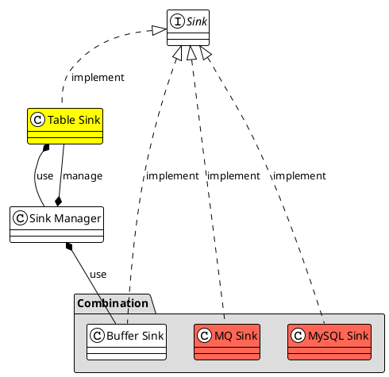

---
transition: slide-up
---

# Old Sink Problems

- Circular dependency
- Too many buffers
- Leak table information everywhere
- Call stack is too deep and all calls are synchronous
- Abstraction is very complicated and too many functions in the interface
- Some implementations are not thread-safe, but they should be

---
transition: slide-up
layout: center
---

# New Sink Design

---

<div class="relation">

<div class="title">

# New Sink Design

</div>
<div class="uml">

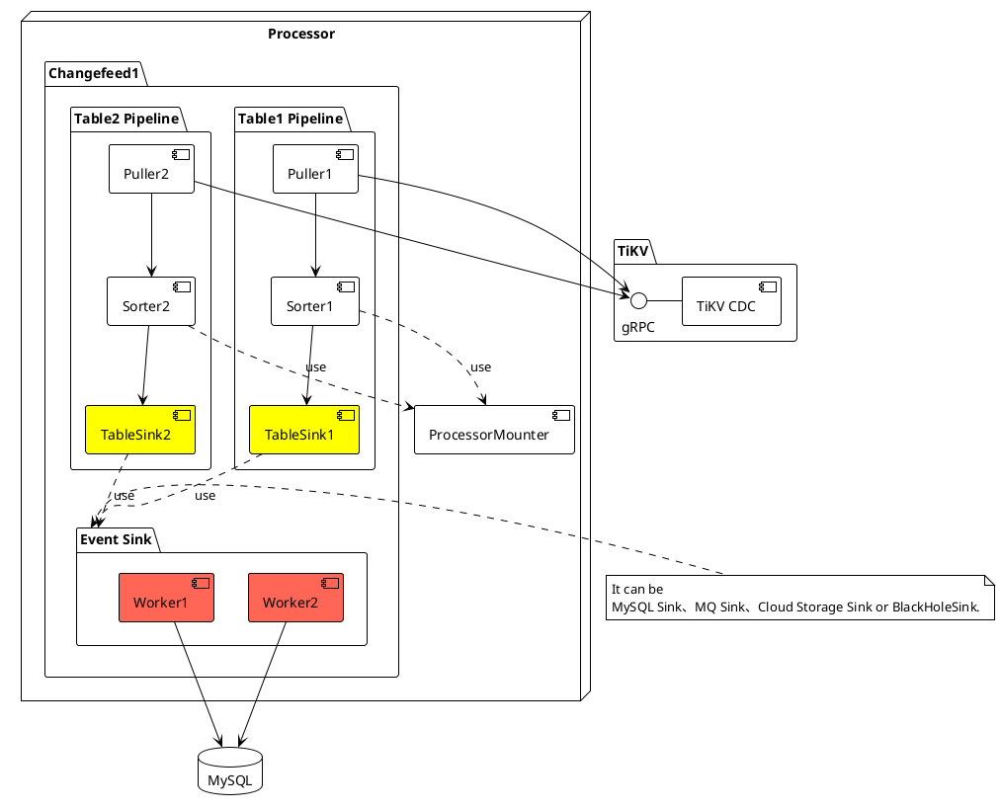

</div>
</div>

<style>
.relation {
  display: flex;
  justify-content: flex-start;
}

.relation img {
  height: 500px;
}

.relation .title {
  flex-grow: 4;
}

.relation .uml {
  flex-grow: 2;
}

h1 {
  background-color: #2B90B6;
  background-image: linear-gradient(45deg, #4EC5D4 10%, #146b8c 20%);
  background-size: 50%;
  -webkit-background-clip: text;
  -moz-background-clip: text;
  -webkit-text-fill-color: transparent;
  -moz-text-fill-color: transparent;
  writing-mode: vertical-rl;
  text-orientation: mixed;
}
</style>

---
transition: slide-up
---

# New Sink Module Abstract

<br/>
<br/>

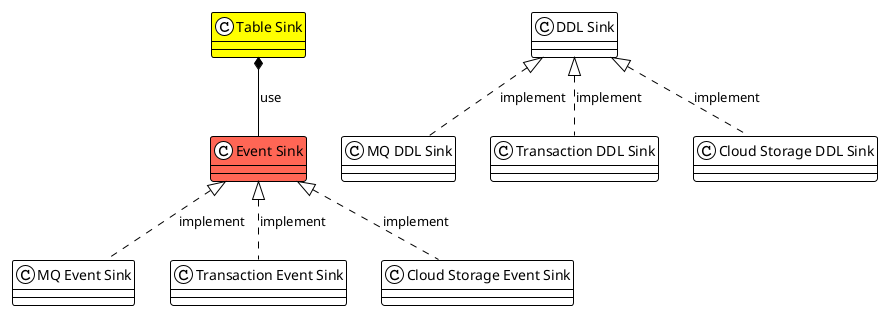

<br/>

&nbsp;&nbsp;&nbsp;&nbsp;&nbsp;&nbsp;&nbsp;&nbsp;[Table Sink](https://github.com/pingcap/tiflow/tree/v6.5.1/cdc/sinkv2/tablesink)
· [Event Sink](https://github.com/pingcap/tiflow/blob/v6.5.1/cdc/sinkv2/eventsink/event_sink.go) · [DDL Sink](https://github.com/pingcap/tiflow/tree/v6.5.1/cdc/sinkv2/ddlsink) · [MQ Event Sink](https://github.com/pingcap/tiflow/tree/v6.5.1/cdc/sinkv2/eventsink/mq) · [Transaction Event Sink](https://github.com/pingcap/tiflow/tree/v6.5.1/cdc/sinkv2/eventsink/txn) · [Cloud Storage Event Sink](https://github.com/pingcap/tiflow/tree/v6.5.1/cdc/sinkv2/eventsink/cloudstorage)

---
transition: slide-up
---

# New Data Sequence (Async)

## Row Change Data Sequence

<br/>

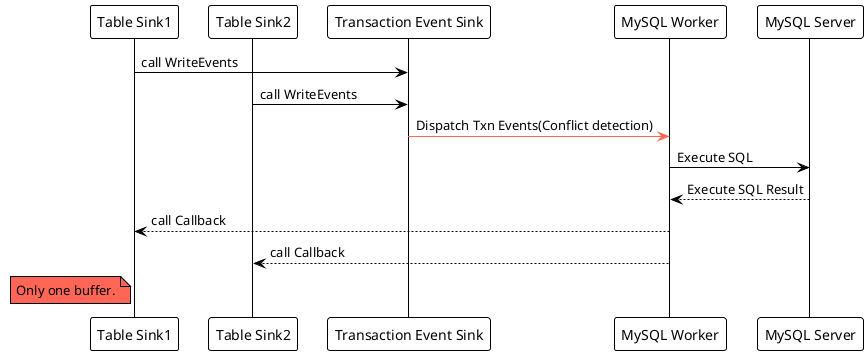
---
transition: slide-up
---

# Table Sink

## Abstract

```go{all|7|11|15}
// TableSink is the interface for table sink.
// It is used to sink data in table units.
type TableSink interface {
	// AppendRowChangedEvents appends row changed events to the table sink.
	// Usually, it is used to cache the row changed events into table sink.
	// This is a not thread-safe method. Please do not call it concurrently.
	AppendRowChangedEvents(rows ...*model.RowChangedEvent)
	// UpdateResolvedTs writes the buffered row changed events to the eventTableSink.
	// Note: This is an asynchronous and not thread-safe method.
	// Please do not call it concurrently.
	UpdateResolvedTs(resolvedTs model.ResolvedTs) error
	// GetCheckpointTs returns the current checkpoint ts of table sink.
	// For example, calculating the current progress from the statistics of the table sink.
	// This is a thread-safe method.
	GetCheckpointTs() model.ResolvedTs
	// Close closes the table sink.
	// We should make sure this method is cancellable.
	Close(ctx context.Context)
}
```

---
transition: slide-up
---

# Table Sink

## Implementation


```go{all|2|9|4|6|5}
// EventTableSink is a table sink that can write events.
type EventTableSink[E eventsink.TableEvent] struct {
	...
	maxResolvedTs   model.ResolvedTs
	backendSink     eventsink.EventSink[E]
	progressTracker *progressTracker
	...
	// NOTICE: It is ordered by commitTs.
	eventBuffer []E
	state       state.TableSinkState
	...
}
```

```go{0|all}
type EventSink[E TableEvent] interface {
	// WriteEvents writes events to the sink.
	// This is an asynchronously and thread-safe method.
	WriteEvents(events ...*CallbackableEvent[E]) error
	// Close closes the sink.
	Close() error
}
```

---
transition: slide-up
---

<div class="arch">
<div>

# Row Change Data Sequence

</div>

<div>
<br/>
<br/>

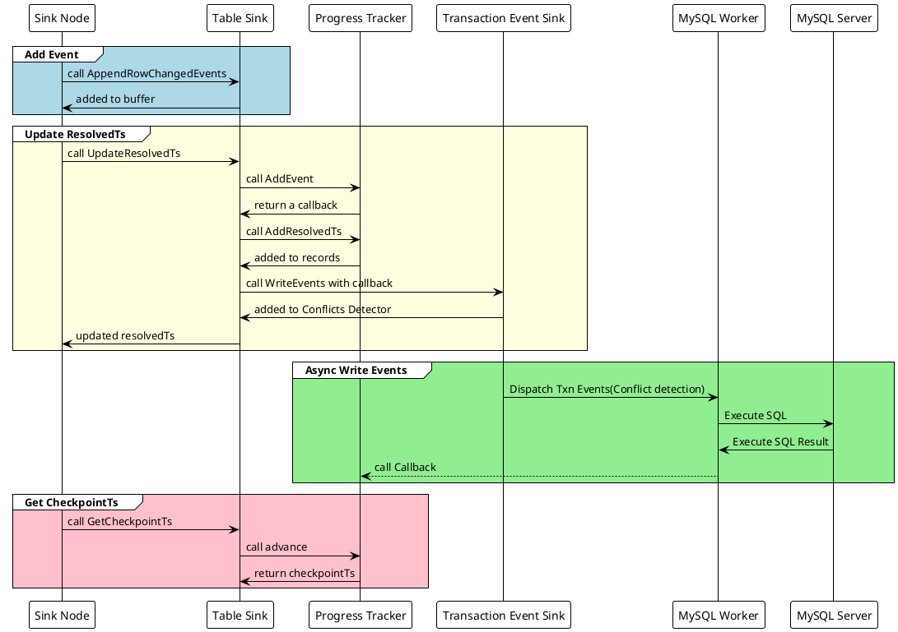

</div>
</div>

<style>
.arch {
  display: flex;
}

.arch img {
  margin-top: -80px;
}

.relation {
  position: absolute;
  z-index: 1;
  left: 120px;
  top: 60px;
  font-size: 12px;
}

h1 {
  background-color: #2B90B6;
  background-image: linear-gradient(45deg, #4EC5D4 10%, #146b8c 20%);
  background-size: 50%;
  -webkit-background-clip: text;
  -moz-background-clip: text;
  -webkit-text-fill-color: transparent;
  -moz-text-fill-color: transparent;
  writing-mode: vertical-rl;
  text-orientation: mixed;
}
</style>

---
transition: slide-up
---

# Table Sink

## Implementation

```go {all|7|17|23|24} {maxHeight:'80%'}
// UpdateResolvedTs advances the resolved ts of the table sink.
func (e *EventTableSink[E]) UpdateResolvedTs(resolvedTs model.ResolvedTs) error {
	...
	e.maxResolvedTs = resolvedTs

	i := sort.Search(len(e.eventBuffer), func(i int) bool {
		return e.eventBuffer[i].GetCommitTs() > resolvedTs.Ts
	})
	...
	resolvedEvents := e.eventBuffer[:i]
	...
	e.eventBuffer = append(make([]E, 0, len(e.eventBuffer[i:])), e.eventBuffer[i:]...)
	resolvedCallbackableEvents := make([]*eventsink.CallbackableEvent[E], 0, len(resolvedEvents))
	for _, ev := range resolvedEvents {
		ce := &eventsink.CallbackableEvent[E]{
			Event:     ev,
			Callback:  e.progressTracker.addEvent(),
			SinkState: &e.state,
		}
		resolvedCallbackableEvents = append(resolvedCallbackableEvents, ce)
	}
	// Do not forget to add the resolvedTs to progressTracker.
	e.progressTracker.addResolvedTs(resolvedTs)
	return e.backendSink.WriteEvents(resolvedCallbackableEvents...)
}
```

---
transition: slide-up
---

# Table Sink

## Progress Tracker

<br/>

### Can we use a simple counter to track the progress?

<br/>

<v-click>

### What about the performance?

</v-click>
<br/>

<v-click>

### How can we make it faster?

</v-click>

<br/>
<v-click>

##### BitMap

```go{all|1|2}
// 0000000000000000000000000000000000000000000000000000000000000000 ->
// 0000000000000000000000000000000000000000000000000000000000001000
```

</v-click>

---
transition: slide-up
---

# Table Sink

## Progress Tracker

<br/>

```go{all|6|7-10|11-14}
type progressTracker struct {
	// Following fields are protected by `mu`.
	mu sync.Mutex
	...
	// Used to generate the next eventID.
	nextEventID uint64
	// Every received event is a bit in `pendingEvents`.
	pendingEvents [][]uint64
	// When old events are flushed the buffer should be released.
	nextToReleasePos uint64
	// The resolvedTs of the table sink.
	resolvedTsCache []pendingResolvedTs
	// The position that the next event which should be check in `advance`.
	nextToResolvePos uint64
	lastMinResolvedTs model.ResolvedTs
}
```

---
transition: slide-up
---

# Table Sink

## Progress Tracker


```go {all|3-5|7-13|14-18|21-26} {maxHeight:'80%'}
func (r *progressTracker) addEvent() (postEventFlush func()) {
	...
	eventID := r.nextEventID
	bit := eventID % 64
	r.nextEventID += 1

	bufferCount := len(r.pendingEvents)
	if bufferCount == 0 || (uint64(len(r.pendingEvents[bufferCount-1])) == r.bufferSize && bit == 0) {
		// If there is no buffer or the last one is full, we need to allocate a new one.
		buffer := make([]uint64, 0, r.bufferSize)
		r.pendingEvents = append(r.pendingEvents, buffer)
		bufferCount += 1
	}

	if bit == 0 {
		// If bit is 0 it means we need to append a new uint64 word for the event.
		r.pendingEvents[bufferCount-1] = append(r.pendingEvents[bufferCount-1], 0)
	}
	lastBuffer := r.pendingEvents[bufferCount-1]

	// Set the corresponding bit to 1.
	// For example, if the eventID is 3, the bit is 3 % 64 = 3.
	// 0000000000000000000000000000000000000000000000000000000000000000 ->
	// 0000000000000000000000000000000000000000000000000000000000001000
	// When we advance the progress, we can try to find the first 0 bit to indicate the progress.
	postEventFlush = func() { atomic.AddUint64(&lastBuffer[len(lastBuffer)-1], 1<<bit) }
	return
```

---
transition: slide-up
---

# Table Sink

## Progress Tracker

```go {all} {maxHeight:'80%'}
func (r *progressTracker) addResolvedTs(resolvedTs model.ResolvedTs) {
	...
	// If there is no event or all events are flushed, we can update the resolved ts directly.
	if r.nextEventID == 0 || r.nextToResolvePos >= r.nextEventID {
		// Update the checkpoint ts.
		r.lastMinResolvedTs = resolvedTs
		return
	}
	// Sometimes, if there are no events for a long time and a lot of resolved ts are received,
	// we can update the last resolved ts directly.
	tsCacheLen := len(r.resolvedTsCache)
	if tsCacheLen > 0 {
		// The offset of the last resolved ts is the last event ID.
		// It means no event is adding. We can update the resolved ts directly.
		if r.resolvedTsCache[tsCacheLen-1].offset+1 == r.nextEventID {
			r.resolvedTsCache[tsCacheLen-1].resolvedTs = resolvedTs
			return
		}
	}
	r.resolvedTsCache = append(r.resolvedTsCache, pendingResolvedTs{
		offset:     r.nextEventID - 1,
		resolvedTs: resolvedTs,
	})
}
```

---
transition: slide-up
---

# Table Sink

## Progress Tracker

```go {all|2-10|13-32|34-48|49-59} {maxHeight:'80%'}
func (r *progressTracker) advance() model.ResolvedTs {
	// `pendingEvents` is like a 3-dimo bit array. To access a given bit in the array,
	// use `pendingEvents[idx1][idx2][idx3]`.
	// The first index is used to access the buffer.
	// The second index is used to access the uint64 in the buffer.
	// The third index is used to access the bit in the uint64.
	offset := r.nextToResolvePos - r.nextToReleasePos
	idx1 := offset / (r.bufferSize * 64)
	idx2 := offset % (r.bufferSize * 64) / 64
	idx3 := offset % (r.bufferSize * 64) % 64
	for {
		...
		currBitMap := atomic.LoadUint64(&r.pendingEvents[idx1][idx2])
		if currBitMap == math.MaxUint64 {
			// Move to the next uint64 word (maybe in the next buffer).
			idx2 += 1
			if idx2 >= r.bufferSize {
				idx2 = 0
				idx1 += 1
			}
			r.nextToResolvePos += 64 - idx3
			idx3 = 0
		} else {
			// Try to find the first 0 bit in the word.
			for i := idx3; i < 64; i++ {
				if currBitMap&uint64(1<<i) == 0 {
					r.nextToResolvePos += i - idx3
					break
				}
			}
			break
		}
	}
	// Try to advance resolved timestamp based on `nextToResolvePos`.
	if r.nextToResolvePos > 0 {
		for len(r.resolvedTsCache) > 0 {
			cached := r.resolvedTsCache[0]
			if cached.offset <= r.nextToResolvePos-1 {
				...
				r.resolvedTsCache = r.resolvedTsCache[1:]
				if len(r.resolvedTsCache) == 0 {
					r.resolvedTsCache = nil
				}
			} else {
				break
			}
		}
	}
	// If a buffer is finished, release it.
	for r.nextToResolvePos-r.nextToReleasePos >= r.bufferSize*64 {
		r.nextToReleasePos += r.bufferSize * 64
		// Use zero value to release the memory.
		r.pendingEvents[0] = nil
		r.pendingEvents = r.pendingEvents[1:]
		if len(r.pendingEvents) == 0 {
			r.pendingEvents = nil
		}
	}
	return r.lastMinResolvedTs
}
```
---
transition: slide-up
layout: center
---

# MySQL Sink

---
transition: slide-up
---

# MySQL Sink Data Sequence (Async)

## Row Change Data Sequence

<br/>


---
transition: slide-up
---

# MySQL Sink

## Conflict Detection - Union Set

```sql{all|1|2|3|4|5|6}
DML1: INSERT INTO t VALUES (1, 2);
DML2: INSERT INTO t VALUES (2, 3);
DML3: UPDATE t SET pk = 4, uk = 3 WHERE pk = 2;
DML4: DELETE FROM t WHERE pk = 1;
DML5: REPLACE INTO t VALUES (1, 3);
DML6: INSERT INTO t VALUES (5, 6);
```

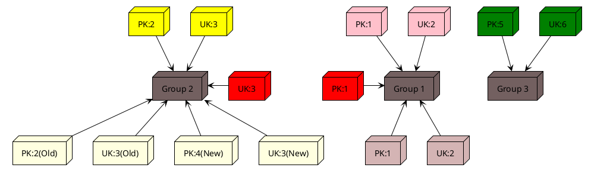

---
transition: slide-up
---

# MySQL Sink

## Conflict Detection - DAG

- Node: Transaction received by Conflict Detector, that has not been executed.
- Edge: T2 -> T1, T1 exists one edge to T2, only if T1 modifies the same key as T2.
<br/>

> We can ignore T2 -> T1, if there exists one path T2 -> Ta -> Tb ... -> Tx -> T1.


```sql{all|1|2|3|4|5|6}
DML1: INSERT INTO t VALUES (1, 2);
DML2: INSERT INTO t VALUES (2, 3);
DML3: UPDATE t SET pk = 4, uk = 3 WHERE pk = 2;
DML4: DELETE FROM t WHERE pk = 1;
DML5: REPLACE INTO t VALUES (1, 3);
DML6: INSERT INTO t VALUES (5, 6);
```

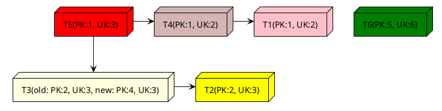

---
layout: center
---

# Q&A

<br/>
<br/>

## Do you have any questions?

---
layout: center
class: text-center
---

# Learn More

[Documentations](https://docs.pingcap.com/tidb/dev/ticdc-overview) · [GitHub](https://github.com/pingcap/tiflow)  · [How to write a new sink](https://hi-rustin.rs/TiCDC-Sink-%E5%BC%80%E5%8F%91%E6%8C%87%E5%8D%97/)
