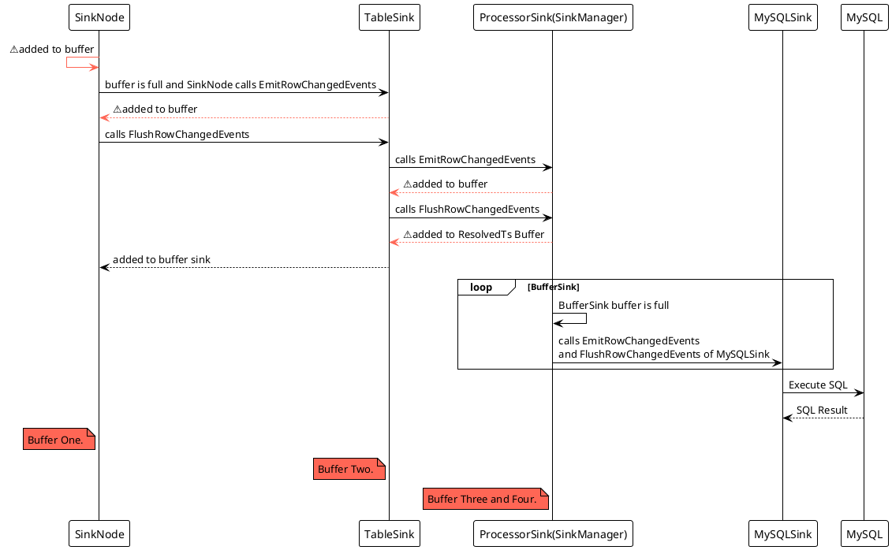
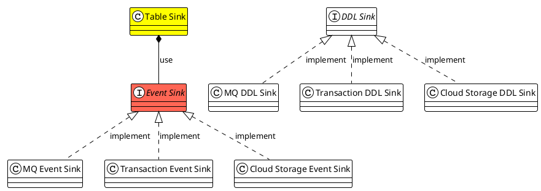
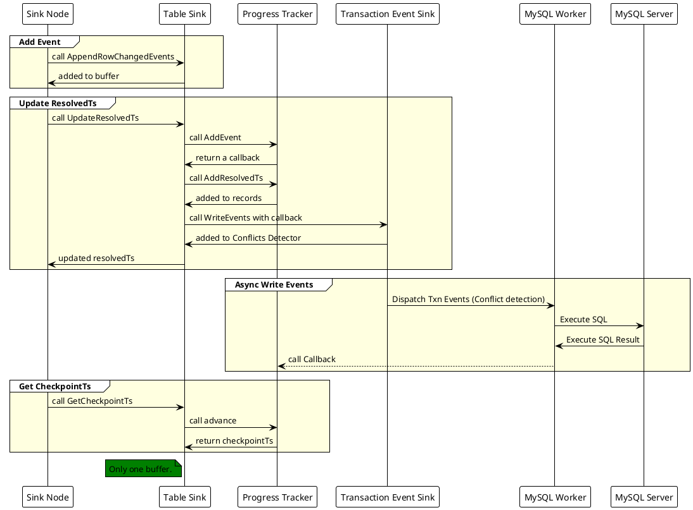
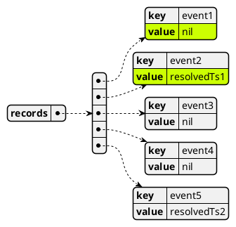

# TiCDC Sink Component

A Deep Dive

Based on TiCDC [v6.5.1](https://github.com/pingcap/tiflow/tree/v6.5.1)

RUSTIN LIU

<div class="pt-12">
  <span @click="$slidev.nav.next" class="px-2 py-1 rounded cursor-pointer" hover="bg-white bg-opacity-10">
    Begin <carbon:arrow-right class="inline"/>
  </span>
</div>

<!--
Alright folks, let's kick off the presentation! I'm assuming most of you are here, so let's dive right in.


Today, I'm gonna talk about the new sink component in TiCDC.
This is gonna be a deep dive, so I'm assuming you already have a basic understanding of TiCDC.

Just a heads up, this talk is based on TiCDC v6.5.1. So if you wanna take a look at the code, make sure to check out the v6.5.1 tag.
-->

---
transition: slide-up
---

# Rustin Liu

<div class="leading-8 opacity-80">
PingCAPer.<br/>
Data Replication Team.<br/>
Cargo Contributor.<br/>
Rustup Maintainer.<br/>
</div>

<div my-10 grid="~ cols-[40px_1fr] gap-y4" items-center justify-center>
  <div i-ri-github-line op50 ma text-xl/>
  <div><a href="https://github.com/hi-rustin" target="_blank">hi-rustin</a></div>
  <div i-ri-twitter-line op50 ma text-xl/>
  <div><a href="https://twitter.com/hi_rustin" target="_blank">hi_rustin</a></div>
  <div i-ri-firefox-line op50 ma text-xl/>
  <div><a href="https://hi-rustin.rs" target="_blank">hi-rustin.rs</a></div>
</div>


<div flex="~ gap2">
</div>

<!--
Before we start, let me introduce myself.

I'm Rustin Liu, a PingCAPer working on the Data Replication Team.

I'm also a Cargo Contributor and a Rustup Maintainer.

You can find me on GitHub, Twitter, and my personal website.

Alright, let's get started!
-->

---
transition: slide-up
layout: center
---

# Sink Refactoring

<br>

### - Phase 1: Introduce a new sink and a new conflict detector.
<br>

### - Phase 2: Change it from push model to pull model.
<br/>

Thanks to [Qu Peng](https://github.com/hicqu)、[Shawn Yu](https://github.com/nongfushanquan)、[Yang Fei](https://github.com/amyangfei) and [Liu Zixiong](https://github.com/liuzix).

<!--
In the past year, we've been refactoring the sink component in TiCDC.

The refactoring is divided into two phases.

In the first phase, we introduced a new sink and a new conflict detector.

In the second phase, we changed the sink from push model to pull model.

Today, I'm gonna talk about the first phase. I believe the second phase needs a separate talk.

I'd like to thank Qu Peng, Shawn, Yang Fei and Liu Zixiong for their contributions to this refactoring.
-->

---
transition: slide-up
layout: center
---

<div text-6xl fw100>
  Agenda
</div>

<br>

<div class="grid grid-cols-[3fr_2fr] gap-4">
  <div class="border-l border-gray-400 border-opacity-25 !all:leading-12 !all:list-none my-auto">

  - Architecture
  - Old & New Sink Module Design
  - Table Sink Deep Dive
  - MySQL Sink Deep Dive
  - Outcomes
  - Q&A

  </div>
</div>

<!--
Alright, let me give you a rundown of what we're gonna cover today.

First, I'm gonna talk about the architecture of TiCDC.

Then, I'm gonna talk about the old and new sink module design.

After that, I'm gonna talk about the table sink and MySQL sink in detail.

Finally, I'm gonna talk about the outcomes of this refactoring.

And of course, we'll have a Q&A session at the end. If you have any questions during the talk, feel free to ask them in the chat.
-->

---
transition: slide-up
layout: center
---

# Architecture

---
transition: slide-up
layout: center
---

<div class="arch">
<div>

# Architecture

</div>

<div
  class="relation"
>

- A TiCDC cluster has only one owner.
- A capture will have multiple processors.
- A processor can only process one changefeed.
- A changefeed can synchronize multiple tables.

</div>

<div>


</div>
</div>

<style>
.arch {
  display: flex;
}

.arch img {
  margin-top: -80px;
}

.relation {
  position: absolute;
  z-index: 1;
  left: 120px;
  top: 60px;
  font-size: 12px;
}

h1 {
  background-color: #2B90B6;
  background-image: linear-gradient(45deg, #4EC5D4 10%, #146b8c 20%);
  background-size: 50%;
  -webkit-background-clip: text;
  -moz-background-clip: text;
  -webkit-text-fill-color: transparent;
  -moz-text-fill-color: transparent;
  writing-mode: vertical-rl;
  text-orientation: mixed;
}
</style>

<!--
Alright, let me break down the TiCDC architecture for you.

So, TiCDC is a distributed cluster, and we refer to each instance as a capture. Each capture can have multiple roles to process the data.

You can imagine this whole picture as a capture.

We can see there are two types of roles. One is the owner. The other one is the processor.
But keep in mind, this is just a logical concept, not a physical one.

In a TiCDC cluster, you can only have one owner, but you can have multiple processors.

The owner is responsible for scheduling tables and executing DDL operations. DDL is a special operation that can't be executed multiple times, so we need to make sure it's only executed once. That's why we need the owner to handle it.

The processor is responsible for replicating data for a changefeed. And each processor can only handle one changefeed at a time.

So, what exactly is a changefeed? Think of it as a configuration file for a set of tables. Users can write a configuration file to describe the changefeed, specifying which tables to replicate and how to replicate them.

Let's take a closer look at the pipelines within a processor.
-->


---

# Table Pipeline

Each changefeed creates a processor, and each processor maintains multiple table pipelines.

### Pipeline
<br>
<br>


<!--
Each pipeline is responsible for replicating data for a single table, and it consists of four components.

First up, we have the puller. The puller is responsible for pulling data from TiKV.

Next, we have the sorter. The sorter is responsible for sorting the data based on commit ts. This ensures that the data is replicated in the correct order.

Then, we have the mounter. The mounter is responsible for decoding the data from its raw format into a structured format that can be easily processed.

Finally, we have the sink. The sink is responsible for sending the data downstream to the target system.

So, this is the basic structure of a table pipeline. Let's focus on the sink for now.
-->

---
transition: slide-up
layout: center
---

# Old Sink Design

---

<div class="relation">

<div class="title">

# Old Sink Design

</div>
<div class="uml">


</div>
</div>

<style>
.relation {
  display: flex;
  justify-content: flex-start;
}

.relation img {
  height: 500px;
}

.relation .title {
  flex-grow: 4;
}

.relation .uml {
  flex-grow: 2;
}

h1 {
  background-color: #2B90B6;
  background-image: linear-gradient(45deg, #4EC5D4 10%, #146b8c 20%);
  background-size: 50%;
  -webkit-background-clip: text;
  -moz-background-clip: text;
  -webkit-text-fill-color: transparent;
  -moz-text-fill-color: transparent;
  writing-mode: vertical-rl;
  text-orientation: mixed;
}
</style>

<!--

The sink is responsible for sending the data downstream to the target system.

In the old design, we have different types of sinks.

The first one is the table sink. The table sink more like a buffer to organize the data in table level.
It's not responsible for sending the data to the target system. Instead, it sends the data to the sink manager.

The second one is buffer sink. The buffer sink is responsible for buffering the data in memory. You can think of it as a cache.

The last one is the MySQL sink. The MySQL sink is responsible for sending the data to MySQL. It can be either MQ Sink or BlackHoleSink.

You might have noticed that the table sink and buffer sink are quite similar in their function of buffering data in memory. So, why did we have two separate sinks? To be honest, I'm not sure. That's why we decided to remove the buffer sink in the new design.

Now, let's talk about the sink manager. The sink manager is responsible for managing the table sinks. However, there's a circular dependency between the table sink and the sink manager. The sink manager creates and destroys table sinks, while the table sinks use the sink manager to send data to the target system.

To make things worse, the sink manager also combines the buffer sink and the MySQL sink. So, in the sink manager, we have three different types of sinks in one place. This makes the code very complicated and hard to maintain.

Now, let's take a closer look at the MySQL sink.
-->

---
transition: slide-up
---

<div class="arch">
<div>

# Old Sink Module Abstract

</div>

<div>
  <br/>
  <br/>
  <br/>


</div>
</div>

<style>
.arch {
  display: flex;
}

.arch img {
  margin-top: -80px;
}

h1 {
  background-color: #2B90B6;
  background-image: linear-gradient(45deg, #4EC5D4 10%, #146b8c 20%);
  background-size: 50%;
  -webkit-background-clip: text;
  -moz-background-clip: text;
  -webkit-text-fill-color: transparent;
  -moz-text-fill-color: transparent;
  writing-mode: vertical-rl;
  text-orientation: mixed;
}
</style>

<!--

When we zoom in MySQL sink, we can see that it's a combination of DML sink and DDL sink. However, only one of these is used per module.

For instance, for the owner module, we only send DDL to MySQL. For the processor module, we only send DML to MySQL.

Then, every time you wanna change something in the MySQL sink, you have to change both DML part and DDL part. This makes the code very hard to maintain.

-->

---
transition: slide-up
layout: two-cols
---

# Old Sink Module Abstract

```go
type Sink interface {
	// FIXME: some sink implementation is not thread-safety, but they should be.
	EmitRowChangedEvents(ctx context.Context, rows ...*model.RowChangedEvent) error

	// TryEmitRowChangedEvents is thread-safety and non-blocking.
	TryEmitRowChangedEvents(ctx context.Context, rows ...*model.RowChangedEvent) (bool, error)

	// FIXME: some sink implementation is not thread-safety, but they should be.
	EmitDDLEvent(ctx context.Context, ddl *model.DDLEvent) error

	// FlushRowChangedEvents flushes each row which of commitTs less than or
	// equal to `resolvedTs` into downstream.
	// FIXME: some sink implementation is not thread-safety, but they should be.
	FlushRowChangedEvents(ctx context.Context, tableID model.TableID, resolvedTs uint64) (uint64, error)

	// FIXME: some sink implementation is not thread-safety, but they should be.
	EmitCheckpointTs(ctx context.Context, ts uint64, tables []model.TableName) error
	...
}
```

::right::

<br/>
<br/>


<!--
Let's take a look at the sink interface.

All sinks must implement this interface, which can be quite complex. It contains numerous methods, some of which are thread-safe, while others are not. Additionally, some methods are blocking, while others are not.

This makes it very hard to implement a new sink. Especially we combine the buffer sink and the MySQL sink in the sink manager and combine the DML sink and the DDL sink in the MySQL sink.

It's a bit crazy, and it can be tough to maintain. If you don't have GoLand, reading the code can be a real challenge. It's easy to get lost in the code.
-->


---

# Old Data Sequence (Sync)



<!--

Let's take a look at the data sequence. This will help you understand how the code works.

The process starts with the sink node. Whenever the sink node receives a row changed event, it adds it to a buffer. Once the buffer is full, it calls the table sink to emit the row changed events.

The table sink then adds the row changed events to its own buffer and waits for a flush signal.

Once the sink node receives a signal from the previous node, it calls the table sink to flush the row changed events.

The table sink then calls the processor sink to emit the row changed events and flush the row changed events.

The processor sink also has two buffers. One is for row changed events, and the other is for resolvedTs. Once the buffer for row changed events is full, the processor sink calls the MySQL sink to emit the row changed events and flush the row changed events.

Finally, the MySQL sink converts the row changed events to SQL and sends them to MySQL.

As you can see, this process is quite complex, and there are several buffers involved. The sink node, table sink, and processor sink all have their own buffers. Additionally, if we use a Kafka producer, there is another buffer in the Kafka producer.

Overall, this process requires a lot of coordination and careful management of buffers to ensure that data is processed correctly and efficiently.

-->

---
transition: slide-up
---

# Old Sink Problems

- Circular dependency
- Too many buffers
- Leaks table information everywhere
- Call stack is too deep and all calls are synchronous
- Abstraction is very complicated and there are too many functions in the interface
- Some implementations are not thread-safe, but they should be

<!--
To summarize the issues with the old sink, there are several problems that need to be addressed.

Firstly, there is a circular dependency between the sink manager and the table sink, which makes it difficult to understand and maintain the code.

Secondly, there are too many buffers, which makes it hard to manage and can lead to memory issues.

Thirdly, the sink leaks table information everywhere, making it difficult to maintain and add new features.

Fourthly, the call stack is too deep, and all calls are synchronous, making it hard to debug the code.

Fifthly, the abstraction is too complicated, and there are too many functions in the interface, which makes it hard to add new features.

Finally, some implementations are not thread-safe. It's important to be careful when making changes to ensure thread safety.

Let me show you how we solved these problems.

-->

---
transition: slide-up
layout: center
---

# New Sink Design

---

<div class="relation">

<div class="title">

# New Sink Design

</div>
<div class="uml">


</div>
</div>

<style>
.relation {
  display: flex;
  justify-content: flex-start;
}

.relation img {
  height: 500px;
}

.relation .title {
  flex-grow: 4;
}

.relation .uml {
  flex-grow: 2;
}

h1 {
  background-color: #2B90B6;
  background-image: linear-gradient(45deg, #4EC5D4 10%, #146b8c 20%);
  background-size: 50%;
  -webkit-background-clip: text;
  -moz-background-clip: text;
  -webkit-text-fill-color: transparent;
  -moz-text-fill-color: transparent;
  writing-mode: vertical-rl;
  text-orientation: mixed;
}
</style>

<!--

As you can see, it's much simpler than the old design.

Basically, we got rid of the sink manager and the buffer sink. Now, we only have two types of sinks: table sinks and event sinks.

The table sink is just a simple buffer that stores row changed events. On the other hand, the event sink is responsible for writing those row changed events to the target system.

We made the table sink more focused by limiting its scope to just being a buffer. It doesn't have any knowledge of the target system anymore.

As for the event sinks, we don't have any table information there. We just have some workers that handle writing the row changed events to the target system.

Let's check out the code to see how we implemented this design.

-->

---
transition: slide-up
---

# New Sink Module Abstract

<br/>
<br/>



<br/>

&nbsp;&nbsp;&nbsp;&nbsp;&nbsp;&nbsp;&nbsp;&nbsp;[Table Sink](https://github.com/pingcap/tiflow/tree/v6.5.1/cdc/sinkv2/tablesink)
· [Event Sink](https://github.com/pingcap/tiflow/blob/v6.5.1/cdc/sinkv2/eventsink/event_sink.go) · [DDL Sink](https://github.com/pingcap/tiflow/tree/v6.5.1/cdc/sinkv2/ddlsink) · [MQ Event Sink](https://github.com/pingcap/tiflow/tree/v6.5.1/cdc/sinkv2/eventsink/mq) · [Transaction Event Sink](https://github.com/pingcap/tiflow/tree/v6.5.1/cdc/sinkv2/eventsink/txn) · [Cloud Storage Event Sink](https://github.com/pingcap/tiflow/tree/v6.5.1/cdc/sinkv2/eventsink/cloudstorage)

<!--

First, the table sink uses the event sink to write row changed events to the target system.

Second, the event sink is an interface that has multiple implementations. We have the MQ event sink, the transaction event sink, and the cloud storage event sink.

At the same time, we separated the DDL sink and the event sink. Trust me, it's a good idea.

For instance, in Kafka, we use a async producer to write row changed events to Kafka. However, we use a sync producer to write DDL events to Kafka. Right now, we don't need to worry about the error handling of the async producer. We can just use the sync producer to write DDL events to Kafka. It's much simpler.

-->

---
transition: slide-up
---

# Table Sink

## Abstract

```go{all|6|10|14}
// It is used to sink data in table units.
type TableSink interface {
	// AppendRowChangedEvents appends row changed events to the table sink.
	// Usually, it is used to cache the row changed events into table sink.
	// This is a not thread-safe method. Please do not call it concurrently.
	AppendRowChangedEvents(rows ...*model.RowChangedEvent)
	// UpdateResolvedTs writes the buffered row changed events to the eventTableSink.
	// Note: This is an asynchronous and not thread-safe method.
	// Please do not call it concurrently.
	UpdateResolvedTs(resolvedTs model.ResolvedTs) error
	// GetCheckpointTs returns the current checkpoint ts of table sink.
	// For example, calculating the current progress from the statistics of the table sink.
	// This is a thread-safe method.
	GetCheckpointTs() model.ResolvedTs
	// We should make sure this method is cancellable.
	Close(ctx context.Context)
}
```

<!--

The table sink interface is super easy to use! There are just four methods you need to know.

First up, we've got the AppendRowChangedEvents method. This one is used to store any row changed in the table sink.

Next, we've got the UpdateResolvedTs method. This method writes all of the cached row changed events to the event sink.

The third method is called GetCheckpointTs. This one is used to get the current checkpoint ts of the table sink.

And finally, we've got the Close method.

So as you can see, the table sink is just a simple buffer that stores row changed events. It doesn't have any knowledge of the target system.
-->

---
transition: slide-up
---

# Table Sink

## Implementation


```go{all|2|8-9|4|6|5}
// EventTableSink is a table sink that can write events.
type EventTableSink[E eventsink.TableEvent] struct {
	...
	maxResolvedTs   model.ResolvedTs
	backendSink     eventsink.EventSink[E]
	progressTracker *progressTracker
	...
	// NOTICE: It is ordered by commitTs.
	eventBuffer []E
	state       state.TableSinkState
	...
}
```

```go{0|all}
type EventSink[E TableEvent] interface {
	// WriteEvents writes events to the sink.
	// This is an asynchronously and thread-safe method.
	WriteEvents(events ...*CallbackableEvent[E]) error
	Close() error
}
```

<!--
The implementation of the table sink is really easy to understand. Basically, we have a generic struct that can write any type of events. Depending on the system, we may want to write the changed events row by row or transaction by transaction. The generic struct supports both of these options.

To store the events, we use a buffer slice, and we use the max resolved ts as a signal to know when to write the events to the event sink. We also have a progress tracker to keep track of the progress of the table sink. When you call the get checkpoint ts method, it calculates the progress from the progress tracker.

Finally, we have a backend sink that writes the events to the target system, which is the event sink. The event sink interface is simple, with a write events method and a close method. However, you may notice that the events parameter is a slice of callbackable events. This is because we coupled a callback with the event, so we can know when the event is written to the target system.

To help you understand the table sink and the event sink better, let me show you the data flow.
-->

---
transition: slide-up
---

<div class="arch">
<div>

# Row Change Data Sequence

</div>

<div>
<br/>
<br/>



</div>
</div>

<style>
.arch {
  display: flex;
}

.arch img {
  margin-top: -80px;
}

.relation {
  position: absolute;
  z-index: 1;
  left: 120px;
  top: 60px;
  font-size: 12px;
}

h1 {
  background-color: #2B90B6;
  background-image: linear-gradient(45deg, #4EC5D4 10%, #146b8c 20%);
  background-size: 50%;
  -webkit-background-clip: text;
  -moz-background-clip: text;
  -webkit-text-fill-color: transparent;
  -moz-text-fill-color: transparent;
  writing-mode: vertical-rl;
  text-orientation: mixed;
}
</style>

<!--
The data flow also starts from the sink node. I divided the data flow into four parts.

The first part is the add event part. When the sink node receives a row changed event, it calls the append row changed events method of the table sink. The table sink then adds the event to the buffer.

The second part is the update resolved ts part. When the sink node receives a resolved ts, it calls the update resolved ts method of the table sink. The table sink then calls the add event method of the progress tracker to add the resolved ts to the records.
Every time the table sink adds a event to the progress tracker, it returns a callback. The table sink then calls the write events method of the event sink with the callback. The event sink then adds the callbackable event to the conflicts detector.

The third part is the async write events part. When conflict detection is done, the MySQL worker executes the SQL statement and handles the result. Then, it calls the callback method of the progress tracker to notify the table sink that the event is written to the target system.

The last part is the get checkpoint ts part. When the sink node calls the get checkpoint ts method of the table sink, the table sink calls the advance method of the progress tracker to calculate the progress. Then, it returns the checkpoint ts to the sink node.


Basically, in this system, there's only one buffer in the table sink. The event sink is like a writer that simply writes the events to the target system. We make sure not to leak any table information to the event sink.

-->

---
transition: slide-up
---

# Table Sink

## Implementation

```go {all|6-8|15-19|23|24} {maxHeight:'80%'}
// UpdateResolvedTs advances the resolved ts of the table sink.
func (e *EventTableSink[E]) UpdateResolvedTs(resolvedTs model.ResolvedTs) error {
	...
	e.maxResolvedTs = resolvedTs

	i := sort.Search(len(e.eventBuffer), func(i int) bool {
		return e.eventBuffer[i].GetCommitTs() > resolvedTs.Ts
	})
	...
	resolvedEvents := e.eventBuffer[:i]
	...
	e.eventBuffer = append(make([]E, 0, len(e.eventBuffer[i:])), e.eventBuffer[i:]...)
	resolvedCallbackableEvents := make([]*eventsink.CallbackableEvent[E], 0, len(resolvedEvents))
	for _, ev := range resolvedEvents {
		ce := &eventsink.CallbackableEvent[E]{
			Event:     ev,
			Callback:  e.progressTracker.addEvent(),
			SinkState: &e.state,
		}
		resolvedCallbackableEvents = append(resolvedCallbackableEvents, ce)
	}
	// Do not forget to add the resolvedTs to progressTracker.
	e.progressTracker.addResolvedTs(resolvedTs)
	return e.backendSink.WriteEvents(resolvedCallbackableEvents...)
}
```

<!--
Let's check out some code.

The update resolved ts method advances the resolved ts of the table sink. It first updates the max resolved ts of the table sink. Then, it searches for the events that are smaller than the resolved ts. It then removes the resolved events from the buffer and adds them to the resolved callbackable events. Finally, it calls the write events method of the event sink with the resolved callbackable events.

That's it. It's pretty simple, right?

Let's move on to the progress tracker. The progress tracker is the core of the table sink. It tracks the progress of the table sink and calculates the checkpoint ts.
-->

---
transition: slide-up
---

# Table Sink

## Progress Tracker

Example: txn1, txn2, resolvedTs2, txn3-1, txn3-2, resolvedTs3, resolvedTs4, resolvedTs5

### How to track the progress?

<v-click>


</v-click>

<!--

Let's say we have a table sink that receives nine events, which are sorted by sorter. Now, the question is, how can we track the progress? Since we write the events to the target system asynchronously, we need to ensure that we update the progress at the right time, neither too early nor too late.


Updating the progress too early can cause correctness issues. For instance, if we update the progress after txn3-1 and txn3-2 are written to the target system, the checkpoint ts be resolvedTs3. However, if txn1 and txn2 are not yet written to the target system, the checkpoint ts should be resolvedTs2. If the system crashes at this point, we will lose txn1 and txn2.

On the other hand, updating the progress too late can cause latency issues. We need to update the progress as soon as possible to reduce latency.

So the naive solution is to use current order to track the progress. We can simply use a list to store the events with a associated event ID.

We can use a linked map to store it. The key is the event ID and the value is the event. For normal events, the value is nil. For resolved events, the value is the resolved ts.

Every time we write an event to the target system, we can remove the event from the linked map. When we want to get the checkpoint ts, we can iterate the linked map to find the first normal event. Then we can update the progress to the last resolved ts before the normal event.

It works and pretty simple, right? However, it is not good enough. Let's see why.
-->

---
transition: slide-up
---

# Table Sink

## Progress Tracker

<br/>

<v-click>

### What about the performance?

</v-click>

<v-click>

It is not good enough because we need get `lock()` to update the progress.

</v-click>

<v-click>

### How can we make it faster?

</v-click>

<br/>
<v-click>

##### BitMap

```go{all|6}
// Set the corresponding bit to 1.
// For example, if the eventID is 3, the bit is 3 % 64 = 3.
// 0000000000000000000000000000000000000000000000000000000000000000 ->
// 0000000000000000000000000000000000000000000000000000000000001000
// When we advance the progress, we can try to find the first 0 bit to indicate the progress.
postEventFlush = func() { atomic.AddUint64(&lastBuffer[len(lastBuffer)-1], 1<<bit) }
```

</v-click>

<!--
When it comes to performance, using a map to store events is not ideal. Since we have multiple workers writing events to the target system, using a map would require getting a lock every time we write an event, which can negatively impact performance.

To improve performance, we can use a list to store events, but instead of using a write lock to protect the entire list, we can narrow down the lock scope. We can use a bitmap to indicate progress and use atomic operations to update it. We can use a uint64 to store the bitmap, where each bit represents an event ID mod 64. For example, if the event ID is 3, the bit is 3 mod 64, which is 3. So the bit is the third bit of the uint64.

After writing an event to the target system, we can use an atomic operation to set the corresponding bit to 1.

When we want to get the checkpoint ts, we can find the first 0 bit to indicate progress.

This is big improvement. But it also makes the code more complicated. I guess it is fair enough since we are dealing with performance issues.
-->


---
transition: slide-up
layout: center
---

# MySQL Sink

---
transition: slide-up
---

# MySQL Sink Data Sequence (Async)

## Row Change Data Sequence

<br/>


<!--

In the previous section, we checked out this diagram. You might have noticed that the MySQL Sink has a conflict detection mechanism.

Now, let's say we receive a massive amount of events from the system. We can't afford to send them one by one because we need to write them to the target system as quickly as possible.

To speed things up, we have multiple workers who can write events to the target system concurrently.

However, we must ensure that the events are written in the correct order. To accomplish this, we need to introduce a detector that can identify conflicts.

We only allow non-conflicting events to be written in parallel. For events that do conflict, we must wait until the previous event has been written to the target system before proceeding.

-->

---
transition: slide-up
---

# MySQL Sink

## Old Conflict Detection - Union Set

```sql{all|1|2|3|4|5|6}
DML1: INSERT INTO t VALUES (1, 2);
DML2: INSERT INTO t VALUES (2, 3);
DML3: UPDATE t SET pk = 4, uk = 3 WHERE pk = 2;
DML4: DELETE FROM t WHERE pk = 1;
DML5: REPLACE INTO t VALUES (1, 3);
DML6: INSERT INTO t VALUES (5, 6);
```


<!--
Let me give you an example of a conflict. If we received these events at the same time, we would have a conflict.

DML1 and DML4 conflict because they both modify the same key. Similarly, DML2 and DML3 conflict because they both modify the same key.

DML5 conflicts with all the other events except DML6 because it modifies the same key as all the other events.

So, how do we detect conflicts? We can use a union set to store the events and identify them using the primary key and unique key. If two events modify the same key, we can put them in the same set.

For example, if we ignore DML5 for now, we can group the events as follows: Group 1 contains DML1 and DML4, Group 2 contains DML2 and DML3, and Group 3 contains only DML6. We can then write the groups to the target system in parallel, with each group being handled by a separate worker.

It's pretty simple, right? However, there is a problem. If we add DML5 to the mix, we will encounter an issue. DML5 conflicts with all the other events, so can't write it in parallel with the other events. We must wait until all the other events have been written to the target system before we can write DML5.

This is a significant problem. If we have a large number of events, we will have to wait a long time before we can write DML5. This is unacceptable. We can write DML6 at any time because it doesn't conflict with any other events. However, DML5 will cause a stop-world problem. Therefore, we need to find a solution to this problem.

-->

---
transition: slide-up
---

# MySQL Sink

## New Conflict Detection - DAG (Directed Acyclic Graph)

- Node: Transaction received by Conflict Detector, that has not been executed.
- Edge: T2 -> T1, T1 exists one edge to T2, only if T1 modifies the same key as T2.
<br/>

> We can ignore T2 -> T1, if there exists one path T2 -> Ta -> Tb ... -> Tx -> T1.


```sql{all|1|2|3|4|5|6}
DML1: INSERT INTO t VALUES (1, 2);
DML2: INSERT INTO t VALUES (2, 3);
DML3: UPDATE t SET pk = 4, uk = 3 WHERE pk = 2;
DML4: DELETE FROM t WHERE pk = 1;
DML5: REPLACE INTO t VALUES (1, 3);
DML6: INSERT INTO t VALUES (5, 6);
```


<!--

In the new conflict detection algorithm, we use a directed acyclic graph to store the events.

First, let's define a few terms.

A node is a transaction that has not been executed, and an edge is a relationship between two transactions. If T2 modifies the same key as T1, we can draw an edge from T2 to T1.
However, we can optimize this process. If there exists a path T2 -> Ta -> Tb ... -> Tx -> T1, we can ignore T2 -> T1. This simplifies the graph and the implementation.

For example, T3 modifies the same key as T2, so we can draw an edge from T3 to T2. Similarly, T4 modifies the same key as T1, so we can draw an edge from T4 to T1. T5 modifies the same key as T4 and T3, so we can draw an edge from T5 to T4 and T3.

T6 doesn't modify the same key as any other transaction, so it doesn't have any edges.

We can solve the stop-world problem by using the graph. We can write T6 to the target system at any time because it doesn't conflict with any other transactions. However, we can't write T5 until we have written T4 and T3 because it conflicts with them. Similarly, we can't write T3 until we have written T because it conflicts with T2.

However, we can write T2 and T1 in parallel because they don't conflict with each other. This is a significant improvement over the previous algorithm.

This is the biggest change in the new MySQL sink. I suggest you read the code to understand how it works.

-->

---

# Outcomes

- Better performance: Union Set -> DAG. (With pull-based-sink: 63.3k/s -> 103k/s)
- Removes some buffers.
- Better abstraction and data flow: Table Sink -> Transaction Event Sink -> MySQL.
- Better testability.
- Better maintainability: all functions are thread-safe and async in Event Sink.
- Easy to add new sinks.

<!--
Alright, let's talk about the outcomes of this project.

Firstly, we were able to improve the performance of the MySQL sink by replacing the union set with a directed acyclic graph. This has resulted in a significant improvement in the sink's performance, and in the real world, we can achieve 60% more throughput when used with the pull-based sink.

Secondly, we have removed some buffers from the old sink and replaced them with only one buffer in the new table sink. This not only saves memory but also improves the sink's performance.

Thirdly, we have improved the abstraction and data flow by using only one data flow in the new sink.

Fourthly, we have improved the testability of the sink by separating the DDL and DML parts into two sinks. This makes it easier to test the sink, as you only need to focus on the DML part when testing the DML sink and the DDL part when testing the DDL sink.

Fifthly, we have made the sink more maintainable by ensuring that all functions are thread-safe and async in the new sink.

Lastly, we have made it easier to add new sinks. In the old sink, we mixed all the sinks together in the sink manager. This made it difficult to understand and add new sinks. In the new sink, you only need to care about the event sink. You don't need to care about the table sink. Because the table sink logic is quite common, you can reuse it in other sinks. This makes it easier to add new sinks.

That's all for my presentation. I hope you found it informative. If you have any questions, please feel free to ask me.
-->

---
layout: center
---

# Q&A

<br/>
<br/>

## Do you have any questions?

---
layout: center
class: text-center
---

# Learn More

[Documentations](https://docs.pingcap.com/tidb/dev/ticdc-overview) · [GitHub](https://github.com/pingcap/tiflow)  · [How to write a new sink](https://hi-rustin.rs/TiCDC-Sink-%E5%BC%80%E5%8F%91%E6%8C%87%E5%8D%97/)
